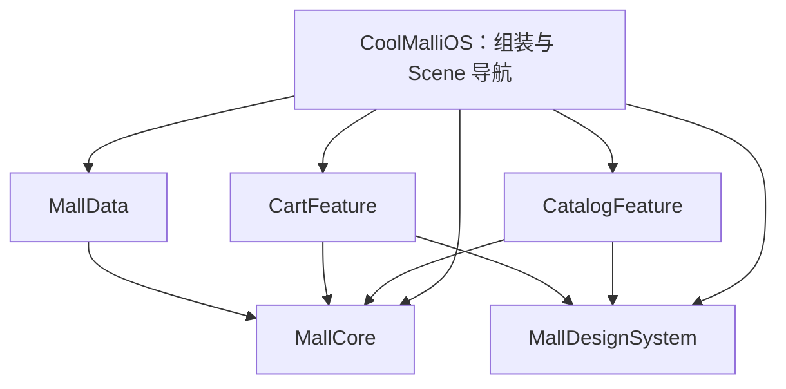

# CoolMall iOS 项目工程手册

更新日期：2026-10-07。适用范围：以 CoolMallKotlin 的业务和接口为参考的新 iOS 客户端。

本手册是架构决策、基础能力选型、代码规约、开发流程和验收要求的统一维护入口。

**当前状态：F0-01 工程/合同及 F0-02 本地检查/测试入口已落地；五个库 Target、App、共享 Scheme/Test Plan、SwiftSyntax 源码检查和工程归属检查均有实际文件。iOS 26.2/27.0 模拟器测试通过；按用户安排，iOS 17 兼容性保留为后续真机待验项。远程 CI 已接入，正常流水线、三类故意违规和主分支实际合并阻断已有证据；Bootstrap PR 仍待维护者复核/合并，F0 整体尚未验收，不进入 F1。** 实际命令、结果与限制见第 8 章。

先阅读第 1—3 章理解方向与边界；实现页面先查 [2.5 MVVM 合同](#25-feature-内部的-mvvm-合同)；开发基础能力时查第 4—6 章；执行构建与检查时查第 7 章；具体开工顺序见 [8.4](#84-接下来如何开工)。

## 目录

- [1. 项目定位与技术基线](#1-项目定位与技术基线)
- [2. 架构与状态管理](#2-架构与状态管理)
- [3. 模块、目录与编译边界](#3-模块目录与编译边界)
- [4. 基础设施与公共组件](#4-基础设施与公共组件)
- [5. 代码规约与依赖管理](#5-代码规约与依赖管理)
- [6. 测试与验收标准](#6-测试与验收标准)
- [7. 开发流程、构建与 CI](#7-开发流程构建与-ci)
- [8. 实施计划与当前状态](#8-实施计划与当前状态)
- [9. 官方参考与手册维护](#9-官方参考与手册维护)

## 1. 项目定位与技术基线

### 1.1 原生 SwiftUI 与架构原则

**已确认的开发方案：按业务功能模块化 + 页面按需使用 MVVM + SwiftUI 组件组合复用 + 协议注入数据能力。** 使用 Observation 和 Swift Concurrency 落实状态观察与并发；第 3 章的 Target 边界、第 2 章的状态所有权仍然有效。

复用 Android 项目的业务知识、接口协议，以及已验证有效的职责分离、单一事实源、依赖隔离和测试方法。iOS 适配重点是 SwiftUI 视图身份、对象所有权、任务生命周期和系统交互。MVVM、Repository、组件化都可用于原生 iOS；无需为了“原生”更换这些设计思想。

Apple 提供状态管理、导航、持久化和并发机制，并未在这里引用的官方指导中要求每个 App 使用 MVVM、Repository 或 Clean Architecture。本项目的模块名称和依赖限制属于工程决策，不标为“Apple 官方架构”。

#### 官方机制与可选模式

| 名称 | 来源、用途 | 本项目用法 |
| --- | --- | --- |
| `@State` | SwiftUI 属性包装器，保存由视图管理的状态 | 局部状态、视图拥有的可观察模型 |
| `@Binding` | SwiftUI 属性包装器，访问由其他位置拥有的值 | 子视图编辑父级值，不额外创建一份状态 |
| `@Bindable` | SwiftUI 属性包装器，为可观察对象属性产生 Binding | 表单需要 `$model.property` 时使用 |
| `@Observable` | Observation 框架的宏 | 有需要时定义可观察模型；它不是线程安全或持久化机制 |
| `@Environment` | SwiftUI 的环境访问机制 | 传递共享会话、购物车等 UI 依赖；必需对象在应用入口和预览中注入 |
| ViewModel | 通用设计模式，不是 Swift 标准库或 SwiftUI 必须继承的类型 | 不要求每个 View 配一个；有页面协调职责时统一使用 `<页面名>ViewModel`，如 `ProductListViewModel`；适用条件见 2.5 |
| Repository | 通用数据访问模式，不是 Swift 内置类型 | 需要统一同一业务数据的缓存/远端/持久化策略时采用；单一来源先用具体能力实现，不并列创建同职责 Service 和 Repository |
| Use Case | 通用业务编排模式，不是 Apple 必选层 | 结算等复杂流程出现时再提取，不为简单转发创建空壳类 |

使用模式本身不会损害原生优势。判断依据是是否遵循 SwiftUI 的状态生命周期、系统交互和并发规则，而不是类型名称是否包含 ViewModel。把 ViewModel 改名为 Model 但保留无意义层次，也不是改进。

参考：[Apple Model Data](https://developer.apple.com/documentation/swiftui/model-data)、[Binding](https://developer.apple.com/documentation/swiftui/binding)、[Bindable](https://developer.apple.com/documentation/swiftui/bindable)、[Managing model data](https://developer.apple.com/documentation/swiftui/managing-model-data-in-your-app)。

### 1.2 平台与工具链基线

- 新工程暂以 iOS 17 为最低版本，便于统一使用 Observation。该版本是项目建议，不是 Apple 对所有 App 的要求；产品覆盖范围确定后再调整。
- 使用 Swift 6 语言模式，显式管理 actor 隔离和跨隔离域传值。编译器版本、语言模式、SDK 版本、最低系统版本是不同概念。
- 本机及 GitHub Actions 实际检查结果均为 Xcode 27.0（27A266a）、Swift 6.4；运行证据见 8.3。通过 `Scripts/check-toolchain.sh` 锁定这套工具链，远程 `xcode-27` 执行器仍在每次运行时校验实际完整版本。formatter 的版本输出为 `main`，因此同时校验所属 Xcode build 和 Swift 编译器完整版本。
- 本机 SDK 为 iOS 27.0，模拟器 runtime 可使用已安装的 iOS 26.2。SDK 决定编译时可见的系统接口，deployment target 决定 App 支持的最低系统，runtime 是实际运行系统；三者不必同版本。设为最低 iOS 27.0 的 App 无法在 iOS 26.2 上运行。当前只按用户要求切换验证设备，不将测试设备版本当成修改最低支持范围的授权；提高最低版本须同步 App、Package、手册和检查器。[Apple 构建设置定义](https://developer.apple.com/library/archive/documentation/DeveloperTools/Reference/XcodeBuildSettingRef/1-Build_Setting_Reference/build_setting_ref.html)
- 新代码采用 Observation；只有最低版本或现有依赖要求时才选择 `ObservableObject`。不为追求“纯新 API”重写兼容性所需代码。

### 1.3 模块化、MVVM 与组件化的关系

| 设计维度 | 要回答的问题 | 本项目决定 |
| --- | --- | --- |
| 功能模块化 | 商品、购物车、账号等能力之间怎样隔离实现和依赖？ | Feature Target 隐藏内部实现；通过 Core 能力和 App 组装协作 |
| MVVM | 一个页面的展示、动作、状态转换与业务能力怎样分工？ | 有页面协调职责时采用 View + ViewModel；业务合同/规则和数据实现按 2.1 分布 |
| UI 组件化 | 页面如何组合控件，共性怎样复用？ | SwiftUI View、ViewModifier、ButtonStyle；用值/Binding/动作闭包提供小接口 |

三者可以同时成立。一个 Feature 可以包含多个页面和各自的 ViewModel，每个页面再由组件组成；不因使用 MVVM 就建立全 App 共用的 Views/ViewModels 大目录，也不因组件可复用就立即给每个组件建立 Target。

当前采用“按功能隔离界面 + 共享业务合同与数据实现”的组合：Feature 是界面业务能力模块，不是每个功能都自带一套网络/数据库。MallCore、MallData 内仍按 Catalog/Cart 等业务归档；该选择属于本项目，不是 iOS 必须的目录规范。后续拆分严格按 3.6 的触发器执行。

| Android 常见机制 | SwiftUI 中相近的职责 | 不能直接等同的部分 |
| --- | --- | --- |
| Composable + 页面 ViewModel | SwiftUI View + 普通 Swift ViewModel | SwiftUI 没有要求继承 Jetpack ViewModel 的对应基类 |
| StateFlow + UI 收集 | Observation 跟踪视图读取的属性 | @Observable 不自动提供事件流、线程安全、持久化或任务作用域 |
| ViewModelStoreOwner 管理存活范围 | 明确的 View/Scene/App 所有者；需要时用 @State 保存视图拥有的可观察对象 | SwiftUI 的视图身份不能按 Android 配置变化生命周期机械推导 |
| 参数 + onValueChange | 值 + 动作闭包，或合适的 Binding | Binding 是读写通道，不自动校验业务或建立新事实源 |
| viewModelScope 等任务管理 | .task/.task(id:) 或明确的任务持有者 | @Observable 本身不会自动取消模型启动的 Task |

Android 与 iOS 复用的是设计思想和业务合同；具体 API、任务取消和对象生命周期分别按平台实现。这里的对照不代表逐行转换关系。官方依据：[Android 架构建议](https://developer.android.com/topic/architecture/recommendations)、[Android ViewModel](https://developer.android.com/topic/libraries/architecture/viewmodel)、[Apple 模型数据管理](https://developer.apple.com/documentation/swiftui/managing-model-data-in-your-app)。

## 2. 架构与状态管理

### 2.1 模块职责与依赖组装

**决定：第一条商品→购物车链路就建立 Feature Target 隔离，取消原方案的单一 MallUI Target。** 一个本地 Swift Package `MallKit`，首期五个生产库 Target，加一个 App Target。不是每个页面一个 Package，也不提前建立空的账号、订单和支付模块。决策依据、代价和后续拆分触发器见第 3 章。

| 模块 | 拥有内容 | 允许的直接项目依赖 | 不允许承担 |
| --- | --- | --- | --- |
| `MallCore` | 商品、金额、购物车快照等业务值；纯规则；`ProductLoading`、`CartCommands`、`CartObserving` 等窄能力协议 | 无 | SwiftUI、HTTP DTO、数据库模型、导航、全局可变容器 |
| `MallData` | APIClient、DTO 映射、存储适配、CartStore、SessionCoordinator；业务能力的真实实现 | MallCore | 页面、展示模型、导航和提示文案 |
| `MallDesignSystem` | 设计语义、无业务依赖的控件和展示组件 | 无 | 商品/订单实体、业务服务、会话、购物车单例 |
| `CatalogFeature` | 首页商品入口、分类/搜索、商品列表与详情；页面模型和专用组件 | MallCore、MallDesignSystem | CartFeature 内部模型、MallData、HTTP/数据库/凭据 API |
| `CartFeature` | 购物车页面、编辑交互、只读快照投影 | MallCore、MallDesignSystem | 自建第二个购物车事实源、CatalogFeature、MallData |
| `CoolMalliOS` App | 依赖创建与生命周期、Scene 根导航、跨功能路由、系统回调、根 UI 投影 | 上述五个库 | 业务规则、逐页实现、自己执行数据库事务 |



箭头是允许的直接编译依赖。Feature 之间无依赖边。公共入口接受 Core 合同和用户动作回调；具体 ViewModel、子页面、DTO 保持 internal/private。App 创建同一个 CartStore，把命令/观察能力分别注入商品页、购物车页和角标投影。商品页“加入购物车”调用 `CartCommands`，不 import CartFeature，也不通过通知广播猜测状态。打开购物车由 App 处理导航意图。

`ProductListViewModel` 接收 `any ProductLoading`，App 注入 HTTPProductService 或测试替身。需要缓存策略时才增加 Repository；不为简单调用强制增加空壳 Use Case。APIClient 只留在数据层。Core 协议按消费者所需能力拆分，不提供能任意查询所有服务的 Service Locator。

平台 SDK 需要 UIKit 展示上下文时，由 App 的桥接层提供；Core 合同不出现 UIViewController。第三方适配的 Target 触发条件见 SPLIT-03。Environment 只传递视图树依赖，不向所有页面暴露 AppDependencies 或任意服务查找器。

### 2.2 状态所有权与 SwiftUI 示例

“所有者”是**有权提交该状态的新版本的对象**，不等于任何持有副本的 View。读取者可以有只读快照，但不能另起一套写入路径。下表是首期业务合同；F0 只实现 fixture 模型和内存 fake，业务对象的实际状态见 8.3。

| 状态 | 唯一写入权与创建位置 | 生命周期/隔离 | 其他位置及冲突处理 |
| --- | --- | --- | --- |
| 弹窗、焦点、展开项 | 最近的 View | 视图身份；主线程 | @State/@FocusState；子组件用 Binding，不双向复制 |
| 查询、列表、页码、加载/错误 | CatalogFeature 的 ProductListViewModel（按搜索/列表实例） | 页面实例、@MainActor | 子 View 只读/发动作；query + generation + requestID 验证响应 |
| 已提交购物车内容 | MallData 的 CartStore，由 App 组装一次 | 按 environment + accountID/guest 分区；actor 或等价串行写入机制 | CartViewModel/角标只是只读投影；持久化成功后发布带 revision 的快照；失败保留上次提交值 |
| 会话事实、凭据及刷新中的任务 | MallData 的 SessionCoordinator，协调 CredentialStore/Keychain | 应用会话；actor；sessionGeneration | App 的 SessionViewModel/Feature 的会话投影只订阅；登录/退出/刷新都经统一命令；旧 generation 不可回写 |
| 导航栈、选中 Tab、跨 Feature 弹层 | App 的 SceneRouter | 每个 Scene，@MainActor | Feature 发类型化意图/回调；不持有其他 Feature 的 ViewModel |
| 表单草稿/未提交购物车编辑 | 当前 Feature 的编辑模型 | 一次编辑会话，@MainActor | 明确为草稿；保存成功更新事实源，取消丢弃；不谎报持久化成功 |
| 订单状态、价格核算、支付结果 | 服务端 | 请求结果按订单 ID 和会话校验 | 客户端缓存/支付 SDK 回调不作为最终订单事实，主动查询确认 |
| 网络/图片缓存、数据库记录 | 对应数据适配器 | 分区、有效期、清理机制明确 | 缓存是恢复/性能副本；账号切换不能污染新会话 |

共享的是合同与事实源，不是跨 Feature 共享具体 ViewModel。CartFeature.CartViewModel 与 App.CartBadgeViewModel 可以各自订阅同一个 CartObserving；它们都不能独立写数组再反向同步。购物车总数/合计从同一 revision 快照派生，不另设可写计数器。若首次展示需要当前值，观察接口必须保证“初始快照 + 后续事件”之间不丢更新，并测试订阅、重连和销毁。

#### 状态规则与触发条件

| 规则 | 何时触发 | 必须完成的动作与验证 |
| --- | --- | --- |
| STATE-01 单一写入权 | 新增可变状态；已有局部状态出现第二个消费者；新增缓存/持久化副本 | 在类型说明或 PR 状态合同中写清所有者、分区键、生命周期、写命令、只读投影和冲突决定权；未说明不合并。跨 Feature 共享必须由 App 注入同一事实源，不能扩大 Feature ViewModel 的访问权限 |
| STATE-02 事件合同 | 新增异步操作或改变任何加载/保存/提交状态转换 | 列出 idle/loading/success/empty/failure 等实际状态、事件和非法转换；至少测成功、失败以及本次引入的取消/竞争分支；多个 bool 不能表示自相矛盾的并行状态 |
| STATE-03 await 后提交 | 请求存在替换查询、刷新、退出、切换账号或重复提交的任一可能 | await 前记录 generation/requestID，提交前再次确认；actor 仍会在 await 处重入，不能把 actor 当成整段异步事务；用可控 fake 反序返回测试 |
| STATE-04 生命周期 | 创建 Task、订阅、通知观察或流 | 明确谁持有、何时取消/移除、错误归谁；页面离开和账号切换各有处理；若操作必须跨页面继续，由相应长生命周期服务持有并记录理由 |
| STATE-05 持久化一致性 | 新增/修改保存、删除、合并、迁移、恢复 | 存储提交成功后才发布已提交快照；测试磁盘重建、失败回滚、账号隔离；乐观 UI 必须独立 pending 状态和回滚合同 |
| STATE-06 权限与外部事实 | 新增系统权限、支付回调、恢复前台处理 | 重新读取系统/服务端事实；不得把本地 bool 或回调成功当永久授权/支付成功；验证拒绝、取消、外部改变 |

状态合同最小字段：`状态名 / owner 类型及 Target / scope 与 key / 隔离 / 写命令 / 读取者 / await 后校验 / 取消与销毁 / 持久化提交点 / 对应测试`。不存在的字段写“无，原因…”。小范围局部展开项可在 PR 中一句说明，不为每个 @State 建独立文件。新增共享事实源或改变写入权按 CHANGE-02 评审。

读取传入的 `@Observable` 对象属性并不一定需要 `@Bindable`。只有控件需要属性的双向 Binding 时才使用它。`@Bindable` 本身不负责创建或维持对象的状态所有权。

下面示例只演示绑定。SearchDraft 是可编辑草稿，没有异步加载或页面协调职责，因此不命名为 ViewModel；它也不是业务事实源。实际搜索请求由 ProductListViewModel 按查询合同处理：

```swift
import Observation
import SwiftUI

@MainActor
@Observable
final class SearchDraft {
    var query = ""
}

@MainActor
struct SearchFormView: View {
    @State private var draft = SearchDraft()
    @State private var inStockOnly = false

    var body: some View {
        Form {
            SearchField(draft: draft)
            StockFilter(isEnabled: $inStockOnly)
        }
    }
}

@MainActor
private struct SearchField: View {
    @Bindable var draft: SearchDraft

    var body: some View {
        TextField("搜索商品", text: $draft.query)
    }
}

@MainActor
private struct StockFilter: View {
    @Binding var isEnabled: Bool

    var body: some View {
        Toggle("仅看有货", isOn: $isEnabled)
    }
}
```

有“保存/取消”的地址编辑页应编辑草稿，保存成功再更新共享数据；直接 Binding 到共享地址会让取消按钮失去撤销含义。

### 2.3 并发与副作用

- 驱动 UI 的可观察模型显式使用 `@MainActor`。Observation 只追踪变化，不保证互斥。
- 网络等待使用 `async/await`；它不保证同步 CPU 工作离开主线程。大型解码、图片处理等应按工具链隔离规则安排执行，并用测量验证。
- 网络、缓存的共享可变状态在有需要时使用 actor 或其他明确隔离方式，不把所有服务都机械标记为 MainActor。
- 跨隔离边界的数据定义正确的 Sendable 语义。不得用 `@unchecked Sendable` 或 `nonisolated(unsafe)` 掩盖设计问题。
- 与页面展示相关的任务可通过 `.task` / `.task(id:)` 管理。异步函数继续传播取消；服务忽略取消时，还需请求标识防止旧结果覆盖新状态。
- 取消操作不当作普通失败弹窗；缓存错误、解码错误和业务错误不统一吞掉返回空列表。
- 创建订单等非幂等操作不能盲目自动重试。客户端防重复点击与服务端幂等保障分别处理。

参考：[Swift Concurrency](https://docs.swift.org/swift-book/documentation/the-swift-programming-language/concurrency/)、[Swift 6 Data Race Safety](https://www.swift.org/migration/documentation/swift-6-concurrency-migration-guide/dataracesafety/)。

### 2.4 原生交互与系统集成

- 使用系统 TabView、NavigationStack、sheet、alert 和原生输入控件；有类型的路由优先携带 ID/必要值，不携带整个服务对象。
- 尊重返回手势、键盘、VoiceOver、Dynamic Type、深色模式和系统布局；不为了还原 Android 截图覆盖 iOS 的交互习惯。
- 优先 SwiftUI 组合。系统能力确需 UIKit 时，通过 Representable 等正式桥接机制接入。
- 图片资源、String Catalog 和 Swift Package 资源按所属模块管理，Package 内资源通过对应 Bundle 获取。
- SwiftData 不是使用 SwiftUI 的前提；本项目的存储选型和验证要求统一见 [4.8 本地存储](#48-本地存储不同数据使用不同合同)。
- Apple 示例中直接使用 `@Query` 是合理原生用法。本商城为了隔离远端协议和购物车缓存，计划将这些存储实现封装在 MallData；这是一项取舍，不是禁止使用 SwiftData。

### 2.5 Feature 内部的 MVVM 合同

本项目页面的基本流向为：`用户动作 → ViewModel → 注入的业务能力 → 结果/快照 → ViewModel 的页面状态 → View 渲染`。组件把动作交回页面，业务命令不通过任意可写 Binding 绕开 ViewModel/事实源。

| 角色 | 应做的事 | 不应做的事 |
| --- | --- | --- |
| View / 子组件 | 根据状态构造 UI、局部焦点/展开状态、发送用户动作、在明确生命周期入口 await 操作 | 在 body 计算中启动副作用；直接访问业务 HTTP/数据库；重算与服务不一致的交易规则 |
| ViewModel | 组织页面状态、处理加载/刷新/提交、把业务错误转换为展示状态；调用能力协议；维护请求有效性 | 持有 View/UIViewController；充当全局服务容器；自己保存 Token；把事实源复制成另一套独立可写数据 |
| 页面 State / Draft | 描述展示状态或可取消的编辑内容；按需要用 struct/enum/可观察草稿 | 当成数据库实体或服务端真相；与 ViewModel 同时各维护一套加载/错误状态 |
| Model 一侧的业务合同与实现 | Core 中的值/规则/能力协议；Data 中的数据访问与一致性策略 | 把 MVVM 的 Model 理解为“只需一个 JSON struct”，或让底层服务负责页面提示与跳转 |

**建立与拆分条件：**以下 VM 规则与 MOD/STATE 一样属于阻断规则，适用于新页面及行为改动的 PR；目前由审查和相应行为测试验证，不宣称清单脚本能检查这些职责。

| ID | 触发条件 | 合并前必须完成 |
| --- | --- | --- |
| VM-01 页面协调 | 页面首次需要业务异步加载/刷新/分页/提交，或跨多个控件协调业务状态 | 在所属 Feature 建立明确的页面 ViewModel，注入能力协议，并可脱离 SwiftUI View 测试成功/失败及相关竞争路径；只有静态展示或局部展开/焦点的 View 不强制建 VM |
| VM-02 对象生命周期 | 创建页面 VM、切换商品 ID/账号、保存或复用 VM 实例 | 标明谁创建、哪个页面身份拥有、何时更新/销毁。子 View 复用传入实例；不在 body 中反复创建，不假定初始化参数变化会替换已由 @State 保留的对象。身份变化时选定重建或显式更新，并撤销旧任务有效性 |
| VM-03 状态读写入口 | 新增可观察输出或双向绑定 | 请求结果、加载/错误、已提交快照对外只读（如 private(set)）；输入草稿可通过 Binding 编辑；提交、持久化和共享状态修改使用动作。无需把所有属性塞进单个万能 UiState，但互斥状态须避免非法组合 |
| VM-04 页面职责扩张 | 同一 VM 开始承担两个可独立进入、拥有独立任务/状态的页面 | 拆成各页面 VM，提取确实共享的合同/机制；列表与详情不能共用一个包揽全部状态的 VM。单个编辑流程内多个子视图可共享一个 VM，不为每个控件配 VM |

ViewModel 默认 `@MainActor @Observable final class`，名称如 ProductListViewModel、ProductDetailViewModel、CartViewModel；实现及初始化默认 internal。Feature 的 public 入口接收协议/初始 ID/导航回调，在内部创建所需 VM，App 不必知道内部 VM 类型。@MainActor 管理 UI 隔离，不保证 await 跨越期间状态不变；沿用 STATE-03。

页面相关读取通过 `.task` / `.task(id:)` await 可取消操作；不能在被 await 的方法中另开未管理 Task 让其提前返回。按钮触发的任务若由 VM 保存句柄，则要声明取消和销毁路径，避免任务与所有者互相长期持有。需要跨页面继续的操作交给适当服务持有。具体规则只在 2.2/2.3 定义，不另造一个统一 BaseViewModel 生命周期框架。

**Repository / Use Case 的提取条件：**

- 一个能力只有直接远端查询时，HTTPProductService 实现 ProductLoading 即可；ViewModel 不依赖这个具体类型。
- 同一业务能力开始协调本地与远端、缓存失效、离线写入或来源冲突时，在 Data 增加明确的 Repository；原消费者继续依赖窄协议。原实现若只是同职责转发，应合并或降为内部数据源，不并排维护两套策略。CartStore 已履行购物车事实源职责时，不再为命名完整加空壳 CartRepository。
- 一段操作要按业务顺序协调多个能力、包含补偿/幂等规则，并且需要独立测试或被第二个入口复用时，提取具体 Use Case。只依赖 Core 合同的纯业务编排可在 Core；包含具体 I/O 机制的部分留在 Data；页面提示留在 Feature。简单一次转发不单独建 Use Case。
- ViewModel 测页面状态；Core 测纯业务规则；Data/Repository 测来源策略和保存一致性；UI 测操作和渲染。测试归属与对象职责对应，验收场景引用第 6 章。

## 3. 模块、目录与编译边界

### 3.1 调研结论与当前取舍

Apple 明确支持用本地 Package 组织模块；Swift 的 internal 访问范围是模块，文件夹没有此效果，package 则允许同包跨模块访问。[Apple 本地 Package](https://developer.apple.com/documentation/xcode/organizing-your-code-with-local-packages)、[Swift 访问控制](https://docs.swift.org/swift-book/documentation/the-swift-programming-language/accesscontrol/)

成熟开源 App 也使用业务模块。例如 IceCubes 的 Timeline 有单独的 Package/Target，依赖 Models、DesignSystem 等，并配置独立测试。它证明这种组织可用于实际应用，但它的具体依赖图、iOS 版本和模块数量不直接作为商城规范。[Timeline 清单](https://github.com/Dimillian/IceCubesApp/blob/main/Packages/Timeline/Package.swift)

| 方案 | 收益 | 代价/风险 | 本项目决定 |
| --- | --- | --- | --- |
| MallUI 一个 Target，Feature 仅文件夹 | 入口和资源管理简单，内部重构方便 | 任意同模块文件能访问 internal；跨功能耦合只能靠审查，后期拆分需收缩已扩散的引用 | 不采用。当前尚无业务代码，且商品与购物车已有明确不同状态职责 |
| 一个本地 Package，按业务能力建 Target | 编译器隐藏实现；依赖和测试归属明确；同仓库原子修改合同与调用者 | 要设计少量 public 入口、资源 Bundle、测试依赖和组装；过度拆分会产生转发接口 | **采用：五个首期库 Target，后续按 3.6 的确定事件扩展** |
| 每页一个 Package/Target | 更细可见性 | 页面切换和共同模型产生大量接口；清单/资源/测试维护成本高；不保证编译更快 | 不采用。列表/搜索/详情同属 CatalogFeature，内部文件夹即可 |
| 多仓库/独立发布所有功能 | 独立版本与交付 | 跨库联调、版本兼容和发布协调成本 | 无独立交付需求，暂不采用 |

以上是针对本项目的工程判断，不是 Apple 强制的 MVVM/模块数量，也不承诺拆分必然提升构建速度。性能是否改善需用同一机器、工具链、干净/增量场景实测。

2026-10-07 在本机 Swift 6.4 做了最小编译实验：同 Target 两个文件互访 internal 成功；输出 CartFeature 模块后，外部访问 CartImplementation 被编译器拒绝；改用 public CartEntry 通过。该实验仅证明语言访问控制，不能替代真实 iOS App/SwiftPM/Xcode 的验证。

### 3.2 目录与 Package 清单

以下是目标布局；F0 已创建实际用到的源码目录，未使用的业务目录仍不创建。真实文件与状态见 8.3：

```text
CoolMall-iOS/
├── ENGINEERING.md                 # 唯一规则正文，包含机器读取的依赖矩阵
├── AGENTS.md                      # AI 执行入口，工程规则引用本手册
├── Scripts/check-boundaries.py    # 清单图检查，配合源码/工程检查
├── Tests/Governance/              # 检查器自身的正/负向测试
├── .swift-format                  # 已创建
├── CoolMalliOS.xcodeproj/         # 已创建并共享 Scheme/Test Plan
├── CoolMalliOS/
│   ├── AppDependencies.swift      # 实例创建和生命周期
│   ├── Navigation/               # SceneRouter、跨功能路由
│   ├── Projections/              # 根会话、角标等只读 UI 投影
│   └── AppCallbacks.swift
├── Packages/MallKit/
│   ├── Package.swift
│   ├── Sources/
│   │   ├── MallCore/{Catalog,Cart,Common}/
│   │   ├── MallData/{Network,Catalog,Cart,Persistence,Authentication}/
│   │   ├── MallDesignSystem/{Tokens,Buttons,Forms,Feedback,Pagination}/
│   │   ├── CatalogFeature/{Entry,Pages,Components,Resources}/
│   │   └── CartFeature/{Entry,Pages,Components,Resources}/
│   └── Tests/{MallCoreTests,MallDataTests,CatalogFeatureTests,CartFeatureTests}/
└── CoolMalliOSUITests/
```

Feature 内部按页面就近组织 View、ViewModel、State；首期商品功能示例：

```text
Sources/CatalogFeature/
├── Entry/CatalogEntryView.swift          # 对 App 暴露的组合入口
├── Pages/
│   ├── ProductList/
│   │   ├── ProductListView.swift
│   │   ├── ProductListViewModel.swift
│   │   └── ProductListState.swift        # 需要独立状态类型时创建
│   └── ProductDetail/
│       ├── ProductDetailView.swift
│       └── ProductDetailViewModel.swift
├── Components/ProductCardView.swift     # Feature 内多个页面共享
└── Resources/
```

仅单页使用的组件放该页面的 Components 子目录；跨页面但同 Feature 的组件放 Feature/Components；跨 Feature 复用按 SPLIT-02。测试按 `Tests/CatalogFeatureTests/ProductList/…` 对应页面组织。Pages 内子目录没有额外编译边界，整个 CatalogFeature 才是一个 Target；不为排列 MVVM 文件再拆 Target。

`{...}` 表示多个同级目录，不是一个真实目录名。只创建已有源码/资源需要的子目录，不放空架子。每个生产文件恰属一个 Target；Package 文件不再加入 App Target Membership。Feature 专用组件留在内部，通用无业务组件进 DesignSystem；Common 不接收“暂时不知道放哪”的代码。

普通 Swift 库 Target 编译成 Module；一个 Package 可包含多个 Target；Product 是对消费者暴露的产品。一个 Target 下创建 Features/A 和 Features/B 不会创建两个 Module。采用默认 `Sources/<Target>`、`Tests/<TestTarget>` 布局，禁止自定义跨目录 path/sources 绕过归属。

首期清单模板（资源出现后，在所属 Target 增加 `.process("Resources")`；不引用不存在目录）：

```swift
// swift-tools-version: 6.0
import PackageDescription

let package = Package(
    name: "MallKit",
    defaultLocalization: "zh-Hans",
    platforms: [.iOS(.v17)],
    products: [
        .library(name: "MallCore", targets: ["MallCore"]),
        .library(name: "MallData", targets: ["MallData"]),
        .library(name: "MallDesignSystem", targets: ["MallDesignSystem"]),
        .library(name: "CatalogFeature", targets: ["CatalogFeature"]),
        .library(name: "CartFeature", targets: ["CartFeature"]),
    ],
    targets: [
        .target(name: "MallCore"),
        .target(name: "MallData", dependencies: ["MallCore"]),
        .target(name: "MallDesignSystem"),
        .target(name: "CatalogFeature", dependencies: ["MallCore", "MallDesignSystem"]),
        .target(name: "CartFeature", dependencies: ["MallCore", "MallDesignSystem"]),
        .testTarget(name: "MallCoreTests", dependencies: ["MallCore"]),
        .testTarget(name: "MallDataTests", dependencies: ["MallData", "MallCore"]),
        .testTarget(name: "CatalogFeatureTests", dependencies: ["CatalogFeature", "MallCore"]),
        .testTarget(name: "CartFeatureTests", dependencies: ["CartFeature", "MallCore"]),
    ],
    swiftLanguageModes: [.v6]
)
```

资源从本模块 `Bundle.module` 获取；其他模块不读取它的资源路径。Feature 的 public 工厂/根 View 返回界面并接收窄合同，不公开 Pages 内部的 ViewModel 和页面状态类型。复杂共享 UI 若需 Core 类型，按 SPLIT-02 提取专门模块，不让 DesignSystem 逐渐变成业务层。

### 3.3 必须遵守的模块规则

| ID | 检查对象、触发事件 | 规则与失败处置 | 验证责任 |
| --- | --- | --- | --- |
| MOD-01 | 每次新增/修改 Target、依赖、Package 或工程配置 | 依赖必须符合 2.1 和下方机器矩阵；未知 Target、额外边、循环、跨 Feature 依赖均阻止合并；先修改合同/设计，不先加 import 解编译错误 | 清单检查 + 评审；App 依赖由 F0 工程检查覆盖 |
| MOD-02 | 每次新增类型或扩大访问权限 | 默认 private/internal；public 只供真实外部消费者，PR 列出消费者；Feature ViewModel/DTO 不公开；禁止用 package、@_spi、@testable import、重导出在生产代码绕界 | 编译器 + F0 源码检查 + 公共 API 审查 |
| MOD-03 | 每次文件移动、新建、工程 Membership 变化 | 仅默认 Sources/Tests 归属；禁止同源多 Target、源码软链接、越界 path、未登记生产源码目录；未知类型/配置拒绝自动放行 | 清单检查覆盖 path/sources；磁盘/App 归属检查 F0 补齐 |
| MOD-04 | 新增跨 Feature 行为 | 读写通过 Core 能力合同；导航由 App 处理；不调用其他 Feature 内部类，不用全局通知/单例替代依赖设计 | 注入测试 + 审查 |
| MOD-05 | 每次 UI/Feature 新增副作用 | 禁止直接 URLSession、Keychain、数据库、支付 SDK；通过注入能力。系统展示桥接只在明确的适配文件 | F0 源码规则 + 人工语义审查；Foundation 能导入不代表所有 API 合规 |
| MOD-06 | 新增第三方库、unsafeFlags、搜索路径、条件依赖 | 默认拒绝；先做 CHANGE-02 设计评审，适配库按 SPLIT-03 建 Target；不得只为消除报错放宽检查 | 清单检查 + 工程配置检查；例外见 7.5 |

`internal` 隐藏模块实现；`package` 比 internal 更宽，不是隔离工具。当前业务模块不使用 package/open 权限；未来若有实际理由，须修改明确规则，而非悄悄启用。测试的 @testable 仅在相应测试 Target 使用。

下面 JSON 是**首期精确依赖矩阵**，由检查脚本从本手册读取，不另维护一份规则配置。数组表示当前应存在的直接依赖，不是随意增删的候选列表。测试 Target 也登记，以防通过测试依赖掩盖生产耦合；DesignSystem 有实际行为测试时再登记对应测试 Target。

<!-- boundary-policy:start -->
```json
{
  "schemaVersion": 1,
  "package": "MallKit",
  "targets": {
    "MallCore": [],
    "MallData": ["MallCore"],
    "MallDesignSystem": [],
    "CatalogFeature": ["MallCore", "MallDesignSystem"],
    "CartFeature": ["MallCore", "MallDesignSystem"]
  },
  "tests": {
    "MallCoreTests": ["MallCore"],
    "MallDataTests": ["MallData", "MallCore"],
    "CatalogFeatureTests": ["CatalogFeature", "MallCore"],
    "CartFeatureTests": ["CartFeature", "MallCore"]
  }
}
```
<!-- boundary-policy:end -->

### 3.4 自动化能保证什么

| 层次 | 能阻止 | 不能单独证明 |
| --- | --- | --- |
| Target + private/internal + 编译 | 跨模块引用不可见实现、类型错误、部分并发错误 | 同模块耦合、错误业务状态、多事实源 |
| 清单图检查（本次已落地） | 未登记/缺失 Target、禁止依赖、循环、未批准外部依赖和自定义源路径/构建设置 | 源码真实 import、App 的 Xcode Membership、运行行为 |
| 源码/工程检查（F0 已实现） | 不合规 import/权限/重导出；App 与 Package 重复归属；违规直接 API 的已知用法 | 所有动态行为和通过别名/类型推断隐藏的违规语义 |
| 行为测试 + 审查 | 关键状态转换、竞争、回滚和职责泄漏 | 所有未来输入；仍需事故回归和设备验证 |

SwiftPM 依赖不是安全沙箱：搜索路径/传递依赖可能暴露模块，必须同时核对清单和源码。当前工具链有 `--explicit-target-dependency-import-check error` 选项，但不能假定它自动传给 xcodebuild 或覆盖 SDK 框架。上游有不同后端/宏依赖行为的问题记录；锁定工具链后用正反例验证再启用，不作为唯一门禁。[SwiftPM #9620](https://github.com/swiftlang/swift-package-manager/issues/9620)、[#8798](https://github.com/swiftlang/swift-package-manager/issues/8798)

正式源码 import 检查使用 SwiftSyntax 处理条件编译、选择性导入、访问级别和属性；不把 rg/正则称为完整语法检查。所有条件分支都检查允许列表，支持的平台分别编译。F0 已定义下方系统模块允许列表（Core 默认 Swift/Foundation；Feature 默认 Swift/SwiftUI/Observation/Foundation；扩展时评审），禁止依赖和危险 API 的适配例外精确到文件和符号。

F0 系统模块允许列表如下；项目模块依赖仍只读取上方精确矩阵。源码检查使用锁定 Xcode 自带的 SwiftSyntax/SwiftParser host 库，不增加 App/Package 第三方依赖。所有条件编译分支均检查；工具脚本仅在 host 运行。扩展系统模块、工程配置或公开 Feature 类型需按 CHANGE-02 评审。

<!-- source-policy:start -->
```json
{
  "schemaVersion": 1,
  "systemImports": {
    "MallCore": [
      "Swift",
      "Foundation"
    ],
    "MallData": [
      "Swift",
      "Foundation"
    ],
    "MallDesignSystem": [
      "Swift",
      "SwiftUI",
      "Foundation"
    ],
    "CatalogFeature": [
      "Swift",
      "SwiftUI",
      "Observation",
      "Foundation"
    ],
    "CartFeature": [
      "Swift",
      "SwiftUI",
      "Observation",
      "Foundation"
    ],
    "CoolMalliOS": [
      "Swift",
      "SwiftUI",
      "Observation",
      "Foundation"
    ],
    "MallCoreTests": [
      "Swift",
      "Foundation",
      "Testing"
    ],
    "MallDataTests": [
      "Swift",
      "Foundation",
      "Testing"
    ],
    "CatalogFeatureTests": [
      "Swift",
      "Foundation",
      "Testing"
    ],
    "CartFeatureTests": [
      "Swift",
      "Foundation",
      "Testing"
    ],
    "CoolMalliOSUITests": [
      "Swift",
      "Foundation",
      "XCTest"
    ]
  }
}
```
<!-- source-policy:end -->

### 3.5 边界检查的实施与验收

已提供入口（从仓库根目录运行）：

```sh
# 检查器自身：正例及故意违规的清单夹具。
Scripts/check-source-boundaries.sh # 先建立 SwiftSyntax 检查器，治理测试依赖它
python3 -m unittest discover -s Tests/Governance -p 'test_*.py' -v
# 真实 Package 清单检查；无 Package 时必须失败，不返回虚假的“通过”。
python3 Scripts/check-boundaries.py
```

检查器读取 ENGINEERING.md 的矩阵并调用 `swift package dump-package`，解析结构而非搜索 Swift 文本。它仍只执行清单层检查。F0 新增 `Scripts/check-source-boundaries.sh`，编译工具链自带 SwiftSyntax/SwiftParser 检查器，随后运行源码与 Xcode 工程检查；检查器不是动态语义或状态一致性的证明。真实 dump、App 编译和负向记录见 8.3。

F0 完成前还必须交付以下验证；缺任一项不能进入 F1 业务扩展。F0 用最小能力合同和 fixture 验证注入/路由，不要求先实现 F1 网络和持久化；F1 的业务验收随对应实现加入，避免阶段前置条件互相依赖：

1. 实际五个库 Target、共享 Scheme/Test Plan 和 Debug/Release 模拟器构建；资源可加载，测试清单不是空集。
2. 生产源码 import/访问修饰检查，以及 App 源码归属、链接依赖、编译选项检查；禁止通过工程搜索路径恢复本来被禁止的依赖。
3. 真实工程的负向夹具：Catalog 导入 Cart/Data、Core 导入 SwiftUI、访问 internal DTO、重复归属源码、生产 @testable、未知 Target/外部依赖分别失败，并核对具体诊断。正常对照必须先通过；“SDK 不存在”不算成功拦截越界。
4. 清单/规则/工具链修改后重跑检查器测试与所有负向夹具；负向用例在临时副本运行，不污染正式源码。
5. 远程门禁验证见 7.4。源码检查和工程检查未实现前，不能在报告里把 boundaries 总门禁标为已通过。

### 3.6 何时必须拆、何时只评审

拆分由**即将引入的耦合/依赖需求**触发，时间点是该需求的首个实现 PR 合并前，不是等某个未来代码行数。以下阈值和范围是项目约定，不声称是 Apple 标准。

| ID | 可判断的触发条件 | 截止点与必须动作 |
| --- | --- | --- |
| SPLIT-01 业务根 | 首次实现 Catalog、Cart、Account、Checkout、Orders 任一业务根的生产代码 | 首个 PR 就使用对应 Feature Target。F0 建 Catalog/Cart；登录/个人资料/地址归 Account；下单/支付交互归 Checkout；订单列表/详情归 Orders。未开始的根不建空 Target；新业务根先分类评审，不塞入 Catalog |
| SPLIT-02 跨功能复用 | 第二个生产 Target 需要复用当前 Feature 的内部算法/组件，准备复制代码、公开 ViewModel 或增加 Feature 依赖 | 合并前提取最小合同/值到 Core，纯视觉到 DesignSystem；同时依赖业务值与 UI 的共性建明确的共享 UI Target（如 CommerceUI）。两端迁移并测同一合同，不让 Feature 互相依赖。仅外观相似、规则不同的代码可以各自保留，PR 说明差异 |
| SPLIT-03 外部适配 | 首次接入第三方图片、支付、地图、分析等运行时 SDK，或已有实现首次被不同系统平台消费者复用 | 接入前为该能力建适配 Target（如 MallImages/MallPayments），限制三方 import，公开接口不泄漏 SDK 类型；只有 App 和登记消费者依赖它。官方 URLSession/SwiftData 不因此被机械拆成单独 Target |
| SPLIT-04 额外产品 | 首次让 Widget、App Extension、独立 App 使用现有业务能力 | 接入前分离该消费者不能使用的 UIKit/SDK/生命周期依赖；如果 Core 已满足，直接复用 Core，无须为“独立”再复制一层；补该产品构建矩阵 |
| SPLIT-05 必须隐藏/依赖环 | PR 要求同 Target 内 A 看不到 B 的实现，或出现 A→B→A 的设计 | 隐藏需求成立则合并前划 Target；依赖环必须先通过提取合同/改变组装方向消除，不能靠 package/public/re-export 绕过。拆模块本身不自动解决循环 |
| REVIEW-01 多人并行 | 两个已排期任务需要独立修改同一个共享模型/服务的状态或公共接口 | 开工前由维护者确认所有权与最小接口；仅修改互不相关的 View 不触发拆分。若确认需隐藏实现/独立能力，转 SPLIT-05/02，否则记录继续同 Target 的理由 |
| REVIEW-02 变更扩散 | 一个用户行为变更需修改 3 个及以上 Feature 的生产文件（纯改名/格式/生成文件不算） | 当前 PR 暂停扩展，列出每处变更为何必要；是公共合同合理传播则做兼容验证，否则先去掉跨功能知识。Core/Data/App 不计 Feature 数量，但仍须正常审查 |
| REVIEW-03 重复缺陷 | 同一状态/合同在第二个独立缺陷中再次出现相同根因，或为第二个 Feature 复制同一状态机修复 | 第二次修复必须同时评审事实源/共享机制并加回归；满足 SPLIT-02 时合并前提取；不同规则不强行泛化 |
| REVIEW-04 构建成本 | 同一工具链/机器上连续 3 次同场景测量，中位构建时间比已记录基线增加 ≥30% | 当前变更说明测量与原因，评审依赖扇出/类型检查/资源成本；不因慢就盲拆 Target，先定位瓶颈；只有建立可复现基线后才启用此信号 |

Review 触发要求当前 PR 有书面结论和维护者确认，**不是自动要求拆模块**，也不能写“以后再看”后直接通过。确认需拆则当前 PR 完成或缩小本次功能范围，先合并重构。只有确有外部阻塞且不会新增越界调用时才能走 7.5 的限期例外。

首期 MallData 内网络、缓存和存储保留业务/技术文件夹：当前都服务同一 App，盲目拆多个服务 Target 的收益不足。发生 SPLIT-03/04/05 就立即改变编译边界，不用“它还不到一万行”作为推迟理由。Catalog 的列表/搜索/详情共享商品查询与导航上下文，默认同 Target；状态仍按页面实例拥有，不合并成巨型 ProductListViewModel。

每次拆分必须同一 PR 交付：清单与本章矩阵、public 入口/消费者说明、源文件/资源唯一归属、App 注入与路由、测试与负向夹具、CI 测试清单、删除旧入口。只移动目录或增加一个空 Target 不算完成。只有第二个仓库需要独立发布版本时才评估独立 Package/仓库；Target 隔离本身不需要多仓库。

## 4. 基础设施与公共组件

### 4.1 提前设计与逐步实现

先确定全局一致的机制和边界，再实现能被首条业务链验证的基础能力。不要让每个页面自行选择网络、存储、错误和权限处理方式；也不要在没有调用场景时造一个包办全部能力的框架。

- **开工前定合同**：状态所有权、依赖图、接口错误语义、会话失效、分页规则、存储分区、权限触发时机、设计语义和最低系统版本。
- **首条业务链之前实现**：依赖组装、可替换网络、基础错误展示、关键设计组件、分页机制、购物车存储、日志与自动检查。
- **对应功能开始前实现**：Token 刷新、相机/定位/通知授权、上传和支付适配。现在定义职责与验收，不提前申请权限、接入无用 SDK 或实现无调用者的服务。
- **出现稳定共性后泛化**：先用商品与订单两个代表性列表验证分页合同，再决定通用模型泛型参数。提前规定共同规则，不等于提前写一个几十个参数的 BaseList。

### 4.2 官方、自研与第三方选型

下表是项目选型，不是“已经安装/实现”的清单。优先采用官方基础机制；封装项目自己的规则；确有复杂实现成本时引入单一第三方，并限制其影响范围。

| 能力 | 默认方案 | 项目封装 | 三方引入条件/结论 |
| --- | --- | --- | --- |
| 主题、字体、间距 | SwiftUI、Asset Catalog、语义 Font | DesignTokens、ButtonStyle、FormField | 不引入整套 UI 框架 |
| 页面、导航、安全区 | NavigationStack、TabView、toolbar、safeAreaInset | ScreenAppearance、类型化 Route、底部操作区组件 | 首版不用导航库 |
| 下拉刷新 | List 的 `.refreshable`；网格容器在最低版本验证 | 统一 async refresh 合同 | 默认不用刷新库 |
| 加载下一页 | 懒加载列表/网格 + 尾部触发 | 分页状态协调器、LoadMoreFooter | 分页协议自有，首版不用第三方 |
| 普通 HTTP | URLSession、Codable、async/await | APIClient、Endpoint、响应解码、会话与错误策略 | Alamofire 为备选，不与默认客户端并行铺开 |
| 商品图片 | 首选评估 Nuke/NukeUI 的稳定版本 | RemoteImage、小范围图片管线配置 | 有实际缓存/缩放/取消需求，避免自研图片引擎 |
| 简单设置 | UserDefaults | 有类型的 PreferencesStore | 无需第三方 |
| 凭据 | Security/Keychain | CredentialStore、按服务和账号隔离 | 首版无需 Keychain 包装库 |
| 购物车等结构化本地数据 | SwiftData | CartStore、schema/迁移与事务操作 | GRDB 是验证失败或复杂 SQL 需求时的备选 |
| 临时文件/附件 | FileManager | AttachmentStore、清理/配额策略 | 先不增加文件库 |
| 选择照片 | PhotosPicker | 图片选择/导入组件 | 不增加通用权限 SDK |
| 相机、定位、通知 | 各自系统框架 | 按能力区分的授权适配器 | 首版不使用统一第三方权限框架 |
| 日志 | OSLog/Logger | 分类、请求关联和脱敏规则 | 只有明确诊断需求时再引入观测 SDK |
| 分享、触感、网页 | ShareLink、系统触感、合适的系统网页组件 | 少量业务配置 | 不重写系统交互 |

项目来源：[Alamofire](https://github.com/Alamofire/Alamofire)、[Nuke](https://github.com/kean/Nuke)、[GRDB](https://github.com/groue/GRDB.swift)。它们分别解决网络、图片和 SQLite 数据访问，不是架构必须依赖的三件套。选定依赖时核对稳定发布、最低系统和 Swift 版本，锁定实际解析版本，不跟随 main。

### 4.3 基础组件与基类

SwiftUI View 通常是值类型，公共 UI 以组合复用。计划组件如下，名字是项目定义，均不是 Apple 内置类型。

| 对象 | 输入/输出合同 | 所属目录 | 不承担的职责 |
| --- | --- | --- | --- |
| DesignTokens | 语义颜色、间距、圆角、文字角色 | MallDesignSystem/Tokens | 任意业务数据 |
| PrimaryButtonStyle | 交互和可用状态的视觉样式 | MallDesignSystem/Buttons | 网络、登录、全局 HUD |
| SubmitButton | 标题、明确的提交状态、点击动作 | 同上 | 内部再维护与业务模型重复的提交状态 |
| FormField | 值的 Binding、输入类型、校验展示 | MallDesignSystem/Forms | 决定服务端业务校验规则 |
| EmptyStateView / ErrorStateView | 文案/图像、可选恢复动作 | MallDesignSystem/Feedback | 自己重试网络或跳登录 |
| LoadMoreFooter | ready/loading/failed/exhausted 等展示状态和重试动作 | MallDesignSystem/Pagination | 页码、HTTP、数据合并 |
| RemoteImage | 资源标识/URL、目标尺寸、占位与失败样式 | 系统版 MallDesignSystem/Images；三方版 MallImages（见 SPLIT-03） | 决定业务 API 鉴权策略 |
| PriceText | Decimal 金额、币种代码、展示上下文（不依赖 Core.Money） | MallDesignSystem/Commerce | 结算规则；不硬编码人民币字符串拼接 |
| QuantityStepper | 数量、允许范围、更新动作 | MallDesignSystem/Commerce | 自行访问购物车数据库 |

纯视觉共性用 ViewModifier/ButtonStyle；需要自有状态和结构的交互才做组件；业务规则放具体业务类型；依赖替换用协议。不要把所有系统控件再包一遍，否则会遮蔽系统参数和无障碍能力。

不建立承载网络、权限、分页、导航和弹窗的 BaseViewModel/BaseScreen。共享的分页或提交机制通过组合持有。UIKit 桥接确需继承 UIViewController/UIHostingController 时允许局部子类，但不因此要求所有页面继承公共控制器。

组件接口优先接收展示值和动作闭包；只有确实允许编辑父级输入时传 Binding。纯组件不接收整个 ProductListViewModel/AppDependencies，也不通过 Environment 随意查找业务服务。页面专用子 View 可复用该页面 VM，但跨页面提取组件时要先收缩为明确的输入/输出。数量组件发出修改意图，由 CartViewModel 调用 CartCommands，保存成功后的快照再驱动显示；表单草稿则可直接使用 Binding。不复制父级输入到另一份 @State 后用双向 onChange 维持同步。

组件必须支持 Dynamic Type、VoiceOver、深浅色和长文案。颜色使用语义角色；不把固定字号/高度铺满全项目。先做实际使用的组件和预览，不预先创建无人调用的完整 UI 套件。

### 4.4 状态栏、导航栏与安全区

三者分开：状态栏是时间/电量区域，导航栏承载页面标题和操作，安全区决定内容避让。不能用一个“状态栏高度常量”同时处理。

- 默认让系统随页面容器管理状态栏，导航标题/操作使用 navigationTitle、toolbar，Tab 导航由根容器持有。
- 统一 `ScreenAppearance` 或小型 ViewModifier 处理语义背景、导航栏表现等，避免每页重复配置；不要嵌套创建 NavigationStack 来设置颜色。
- 底部结算按钮使用安全区感知的布局，例如 safeAreaInset。背景可延伸到边缘，交互内容仍避让系统区域；键盘弹出时单独验证。
- 不固定 20/44/59 等状态栏数值；不查询任意全局 keyWindow 来决定当前页面布局；尊重多 Scene 和横竖屏。
- iOS 17 路线使用该系统可用的 toolbar/safe-area API。新版文档中有直接针对 statusBar 的新 placement，但不得不加版本判断就用于最低版本。新能力与兼容路径集中在一个适配点。
- 特殊全屏页面确需独立状态栏样式时，先验证系统方式；不足再通过受控 UIKit 容器的 preferredStatusBarStyle 等正式机制适配。不使用私有 API、全局 swizzling 或绘制假的系统状态栏。
- `toolbarColorScheme` 配置的是受 SwiftUI 管理的栏，在不同背景可见性下表现有条件；不能把它当作所有界面通用的状态栏颜色开关。

参考：[toolbarColorScheme](https://developer.apple.com/documentation/swiftui/view/toolbarcolorscheme(_:for:))、[safeAreaInset](https://developer.apple.com/documentation/swiftui/view/safeareainset(edge:alignment:spacing:content:))。

### 4.5 刷新与分页

使用常见交互：下拉刷新当前查询；滚动接近底部加载下一页。若设计确需相反手势，作为明确产品交互另行设计，不修改这些语义名称。

**刷新：**普通列表默认 List + `.refreshable { await viewModel.refresh() }`。刷新闭包必须等待本次刷新结束，不能启动一个脱离闭包的 Task 后立即返回，否则系统指示器会提前消失。商品网格可用 ScrollView/LazyVGrid，但要对实际容器及 iOS 17 验证刷新、空列表与短内容手势，不能以“任何 View 都有 refreshable 修饰器”推断任何 View 都自动产生手势。确有容器缺口时局部桥接 UIRefreshControl，再评估第三方。

**分页职责拆分：**

| 部分 | 责任 |
| --- | --- |
| MallCore 的 Page/查询值类型 | 业务调用需要的条目和下一页信息，保持独立于 HTTP 字段 |
| MallData 的分页 DTO/映射 | 解释服务端 page、size、total、list，验证返回合同 |
| CatalogFeature 内的 PageLoader/分页协调器（第二个消费者出现时按 SPLIT-02 提取） | 当前查询、请求去重、并发协调、快照、页码提交与恢复 |
| Feature ViewModel | 具体筛选、排序、商品/订单业务语义 |
| LoadMoreFooter | 展示进度、重试和到底状态；仅发送加载意图 |

首版实现编号分页，不提前实现 cursor、双向历史消息等所有变种。Android 当前 PageRequest 从 1 开始，默认 size=10；NetworkPageData 包含 list 与 pagination，pagination 包含 page/size/total。iOS 初始实现沿用已确认的接口语义；缺字段如何处理需合同测试确定，不擅自把 null 全部解释成“已经到底”。

一个分页实例拥有查询身份（筛选/排序/用户）、已提交快照、活动请求类型、请求标识、分页失败状态。活动类型互斥：none、initial、refresh、append；允许“有旧快照 + 正在刷新”，不允许同时执行互相竞争的刷新与追加。

| 事件 | 必须遵循的状态转换 |
| --- | --- |
| 首次加载 | 显示首屏加载；成功后才建立第一页快照；失败显示页面级恢复入口 |
| 相同查询刷新 | 保留可用旧快照；刷新成功替换列表和分页信息；失败保留旧列表并提示 |
| 筛选/用户发生变化 | 增加 generation，撤销旧请求有效性；不能把旧查询内容冒充为新查询结果 |
| 刷新遇到追加进行中 | 取消追加并使旧响应失效，再刷新第一页 |
| 重复触底 | 本页已有请求时合并/忽略；无下一页时不发请求 |
| 追加成功 | 按稳定 ID 合并；只在成功后推进页码/游标和 next 状态 |
| 追加失败 | 保留内容及下一页位置；错误在底部展示，允许明确重试同一页 |
| 取消/旧响应到达 | 不作为普通错误提示；旧 generation 或 requestID 不得改写状态 |

采用 MainActor 管理 UI 协调器不代表 await 前后的状态不会变化；await 返回后仍检查 generation/requestID。去重策略明确：保留原有顺序，相同 ID 用最新实体更新。total 动态变化时不以去重后的条目数量随意推导下一页，优先服务端分页合同。

触底事件可能因懒布局提前或重复发生，所以不能直接在每个 cell.onAppear 中执行 page += 1。首版自动触发每个有效尾部出现周期至多一次，并提供“加载更多”按钮；短内容如需自动补满一屏，必须有明确上限/无进展检测，防止自动拉完整个数据集。尾部失败后不因继续可见而无限自动重试。

通用分页机制不包含商品筛选 UI、登录导航或统一 Toast。复用的是状态转换与一致性规则，不是强制所有页面采用同一种列表布局。

官方依据：[refreshable](https://developer.apple.com/documentation/swiftui/view/refreshable(action:))。分页状态机属于项目自己的协议和实现。

### 4.6 网络与会话封装

默认 URLSession + async/await + Codable。URLSession 提供传输基础，项目仍要封装后端合同、鉴权、错误和诊断。使用系统网络不等于在每个页面直接写 URLSession.shared。

```text
ProductListViewModel（CatalogFeature）
    → ProductLoading（MallCore 的业务接口）
    → HTTPProductService（MallData，DTO → Product）
    → APIClient（MallData，端点、鉴权、HTTP/业务响应解释）
    → HTTPTransport（MallData 内部可替换边界）
    → URLSession
```

统一使用 APIClient 作为项目客户端名称，不并行实现 HTTPClient/APIClient/NetworkManager 多套客户端。传输替换边界保持 internal，不强制向 Core 暴露 URLRequest 或 URLResponse。

| 对象 | 职责 |
| --- | --- |
| APIEnvironment | Base URL、环境、超时/缓存默认策略；App 注入，生产包不能被任意页面切换 |
| Endpoint<Response> | 相对路径、HTTP 方法、Query/Body、响应类型、鉴权要求与明确重放策略 |
| URLSessionTransport | 发送已构造请求、传回响应、取消、底层传输错误 |
| APIClient | HTTP 校验、后端 Envelope、业务错误、无内容响应策略、诊断关联 |
| SessionCoordinator | 获取凭据、合并 Token 刷新、会话版本与统一失效通知 |
| HTTPProductService 等 | 接口字段映射为业务类型，提供有业务含义的方法 |

参数使用有类型的 Encodable 请求，Query 通过 URLComponents 等正确编码，不拼接未经编码的字符串。共享 JSONDecoder 不随请求修改策略；按服务约定统一日期、金额、空值，并避免并发修改非隔离实例。上传/下载/流式接口拥有明确独立合同，不为了通用 send 方法把所有情况塞入 `[String: Any]`。

**已核对的后端规则：** NetworkResponse 成功业务码为 1000，字段为 code/data/message；这与 HTTP 2xx 是两层检查。AuthInterceptor 将 Token 原值写入 Authorization。AuthService 存在 `user/login/refreshToken`，Auth 包含 token/refreshToken/expire/refreshExpire。实际鉴权失败业务码、过期时间单位与刷新参数需要用真实响应夹具/后端文档再次验证，不假定所有失败都是 HTTP 401，也不发明业务码。

**会话并发：**多个请求同时发现 Token 失效时，共享同一个刷新任务；刷新请求本身不能递归进入刷新流程。刷新完成提交 Token 前验证会话 generation，防止退出或切换账号后旧刷新重新写入登录状态。Keychain 写入失败要明确处理，不能只让内存显示续期成功。

**重放与重试：**只给已确认可安全重放的 Endpoint 开放有限次数自动重试/刷新后重放。不能仅凭 GET/POST 判断所有业务：原项目商品查询就可能用 POST。创建订单、付款、退款等默认不自动重放，需后端幂等合同支持；验证码也不能无限重试。刷新失败集中通知会话层，网络层不弹窗、不跳转，UI 决定交互。

**错误合同：**区分取消、超时/断网、HTTP、业务码、解码、鉴权、存储等错误。跨到 Core/UI 的错误不携带第三方内部类型或原始敏感响应；UI 根据可恢复性决定重试、登录、表单提示。禁止全局网络拦截器对每个失败都弹 Toast，避免分页和并发请求重复打扰。

**缓存与测试：**URLCache 的 HTTP 缓存与商品/购物车业务缓存分别定义；价格、库存和订单提交前由后端确认。网络状态提示不能作为不发请求的绝对依据。通过注入 transport 做单测，通过 URLProtocol/测试服务做 URLSession 适配测试；测试覆盖非 2xx、200+业务失败、缺字段、空 body、取消和并发刷新。

Alamofire 可在大量复杂上传/拦截等需求经评估后替换底层实现，但不应泄露到 Feature。既不因为流行而立即引入，也不为了“纯原生”自行重写复杂网络传输。[URLSession 官方说明](https://developer.apple.com/documentation/foundation/urlsession)

### 4.7 图片加载

商品列表有大量图片，初步选型为 Nuke/NukeUI 稳定版本，由 RemoteImage 隐藏具体组件。它负责缓存、降采样/处理、请求合并、取消等能力；这比自行实现图片缓存引擎更合适。具体版本和缓存限额在列表原型验证后记录，当前未安装任何库。

- RemoteImage 对外接收 URL/资源 ID、展示尺寸、内容模式和占位/失败样式，不让 Feature 直接依赖 Nuke 类型。
- 图片缓存 key 考虑尺寸与必要的账号范围；列表缩略图不解码完整超大图，配置内存/磁盘限额和清理策略。
- 图片通常从 CDN 获取，不统一附加商城 Token；需要认证的图片通过单独受限配置处理，切换用户清理私有缓存。
- 确认取消、复用、离屏、后台恢复和解码的性能行为。图片 URL 刷新后正确失效，不能每次渲染都生成随机缓存 key。
- 接入 Nuke/NukeUI 的首个 PR 按 SPLIT-03 创建 MallImages Target；RemoteImage 与管线适配放其中，Feature 只用包装后的入口。App 配置共享管线，公开接口不泄漏三方类型。使用系统 AsyncImage 的轻量方案可先在 DesignSystem/Images；不能因图片加载例外允许 UI 调用业务 HTTP。

系统 AsyncImage 适合简单场景或原型，但不能用它的存在推断项目已经具备完整可控的商品图片缓存策略。[Nuke 项目能力说明](https://github.com/kean/Nuke)

### 4.8 本地存储：不同数据使用不同合同

不创建一个 `StorageManager.save<T>(key:value:)` 来承载所有持久化。缓存、凭据、设置和业务记录的寿命、隔离与失败语义不同。

| 数据 | 首选实现/目录 | 合同与策略 |
| --- | --- | --- |
| 主题、语言、引导完成标记 | UserDefaults；MallData/Preferences | 类型化键、默认值、设置版本；通过 PreferencesStore 统一读写，避免与 @AppStorage 双轨冲突 |
| Access/Refresh Token | Keychain；MallData/Authentication | CredentialStore 读/保存/删除；服务+账号隔离、可访问性策略、错误处理 |
| 购物车、搜索历史等结构化记录 | SwiftData；MallData/Cart 等 | 业务操作、唯一键、排序、事务保存、schema 版本和迁移 |
| 可重新下载的文件/图片 | Caches 目录及图片管线 | 明确容量/过期/失效；允许系统清理，不当作可靠业务记录 |
| 尚未上传的用户附件 | Application Support/按用途临时目录 | 区分需保留草稿与可丢弃临时文件；完成/取消后的清理 |

首版 CartStore 返回 Core 值类型快照，不跨模块、跨 actor 传递 SwiftData @Model 对象或 ModelContext。SwiftData 使用单一明确隔离的访问入口，必要时 ModelActor 管理上下文；创建方式与执行器需验证，不能把 actor 简单等同于“后台线程”。

购物车身份至少包含账号范围、商品 ID、规格 ID。首版采用“保存成功后发布新快照”；保存失败返回可恢复错误并恢复上下文一致性，不先悄悄显示成功。后续若做乐观更新，需要操作标识、回滚/冲突策略及对应测试，不能混用两种语义。

从第一版定义 VersionedSchema；变更时提供迁移计划和旧数据夹具。迁移失败不自动删除购物车/草稿后重建数据库。测试必须包含真实临时磁盘库的重启恢复，只有内存数据库测试不够。预览可使用内存库或 FakeCartStore。

退出登录先更新会话 generation 并撤销旧请求，再协调私有缓存、凭据及 UI 状态；区分“清空 UI”“切换存储分区”“永久删除记录”。游客购物车如何合并为登录用户购物车是业务决策，不能由存储工具自行决定；未确认前禁止自动合并。

参考：[Keychain Services](https://developer.apple.com/documentation/security/keychain-services)、[ModelActor](https://developer.apple.com/documentation/swiftdata/modelactor)、[SchemaMigrationPlan](https://developer.apple.com/documentation/swiftdata/schemamigrationplan)。

### 4.9 权限封装

不在启动时请求所有权限，不把所有权限压成 `Bool granted`。相机、定位、照片库、通知有不同状态；通知 provisional、照片 limited、定位精度不足等不能统称为拒绝。

| 用户动作 | 系统能力 | 项目入口/处理 |
| --- | --- | --- |
| 从照片选择头像/评价图片 | PhotosPicker | MediaPicker 处理选择、异步导入、取消和失败；使用系统选择器不先申请整个相册权限 |
| 拍摄评价图片 | AVFoundation/合适的系统拍摄桥接 | CameraAuthorization：检查状态、按需请求、不可用设备提示；声明相机用途 |
| 根据当前位置辅助填写地址 | Core Location | LocationAuthorization：按需 When In Use、处理精度和状态变化；拒绝后仍可手动填写 |
| 开启订单通知 | UserNotifications | NotificationAuthorization：读取设置、在相关操作后请求；权限与 APNs 注册/后端绑定是不同流程 |
| 保存图片到照片库 | PhotoKit（若确实提供该功能） | 与“选择已有图片”分开；按所需保存访问级别申请并声明用途 |

只有实际使用某项能力才添加对应 Info.plist 用途说明、SDK 和适配实现。普通访问互联网没有与 Android 相同的通用运行时“网络权限”请求；本地网络发现等特殊能力另行设计。

每种适配器提供读取当前状态和请求所需访问两个动作。需要委托回调的对象由明确所有者保持生命周期；并发请求合并，取消/结束只完成一次回调。依赖 UI RunLoop 的系统对象在正确的主线程/actor 上使用，不能放进任意后台 actor 后假定能收到回调。

请求流程：用户触发功能 → 读取状态 → 未决定时请求 → 按具体授权能力继续或降级。拒绝/受限状态不反复弹系统框；需要时由 UI 提供明确“前往设置”动作。返回前台重新读取状态，不永久缓存授权结果。

授权实现放 MallData/Permissions（仅在 SPLIT-03/04/05 触发时拆平台适配 Target），与业务相关的最小合同和值状态放 MallCore；权限说明、设置按钮、照片选择 UI 放对应 Feature，打开设置由 UI/App 正式调用系统能力。测试用 fake 状态，普通单测不弹真实系统框；真机验证首次、拒绝、设置变更和能力缺失。

参考：[PhotosPicker](https://developer.apple.com/documentation/photosui/photospicker)、[相机访问](https://developer.apple.com/documentation/avfoundation/avcapturedevice/requestaccess(for:completionhandler:))、[定位授权](https://developer.apple.com/documentation/corelocation/requesting-authorization-to-use-location-services)、[通知授权](https://developer.apple.com/documentation/usernotifications/asking-permission-to-use-notifications)。

### 4.10 其他统一能力

- **错误展示**：页面首次失败用错误页，追加失败用页尾，表单失败靠近字段；全局提示只承载适合全局的事件。错误类型与展示文案分开。
- **导航/登录恢复**：Route 携带值与 ID；登录前保存有限的目的地，成功后重新验证，取消不丢失已有浏览状态；会话层不直接操纵导航栈。
- **输入**：地址、电话、验证码使用相应键盘/自动填充、焦点和草稿；客户端校验用于反馈，不能替代服务端规则。
- **日志**：Logger 按网络/存储/会话/分页分类，关联 requestID 和耗时；不记录 Token、密码和完整个人数据。生产和开发日志策略不同。
- **可测试依赖**：时间、请求返回顺序、磁盘失败等通过小范围注入控制；不为可测试性把每一个函数都抽成协议。
- **组件预览**：每个核心组件提供正常、禁用、加载、失败、长文案与深色预览；预览使用 fake，不访问真实服务、付费接口或弹权限框。

## 5. 代码规约与依赖管理

### 5.1 命名与代码表达

命名遵循 [Swift API Design Guidelines](https://www.swift.org/documentation/api-design-guidelines/)，以下为项目补充：

- 类型和协议使用 UpperCamelCase；属性、方法和参数使用 lowerCamelCase。调用处清晰比名称最短更重要。
- 项目自有文件名、目录名中的平台名称统一写作 `iOS`（小写 `i`），例如 `CoolMalliOS.xcodeproj`、`CoolMalliOS/`、`CoolMalliOSApp.swift`；对应 Target、Scheme、Test Plan 与类型名保持一致。
- 使用 `Product`、`CartItem`、`Order` 等业务名。接口 JSON 的字段差异在 DTO/CodingKeys 或映射中处理，不让后端命名决定全部 Swift API。
- 优先有具体含义的 `ProductLoading`、`CartPersisting`，避免没有职责边界的 `Manager`、`Helper`、`CommonService`。
- 页面/组件类型使用 `View` 后缀；页面协调对象使用 `<页面名>ViewModel`；独立页面状态使用 `<页面名>State`，编辑草稿使用 `Draft`。业务值使用 Product/CartItem 等业务名；不把所有类型都叫 Model。创建条件按 2.5，不强制 `View + ViewModel + UseCase + Repository` 四件套。
- 值数据优先用 struct/enum 和 `let`。状态所有权或引用身份确有需要时使用 class/actor。
- 默认限制访问范围；只对跨模块入口开放 `public`。不得为了减少编译错误把全部声明开放。
- 对外 API 和非显然业务约束使用 `///` 文档。注释解释单位、错误、并发隔离和原因，不逐句翻译代码。
- 不建立通用 BaseView、BaseModel 继承体系。复用界面靠组合，复用业务靠具体函数/类型。
- 不用一刀切的函数行数替代判断；如果一个类型混合了渲染、HTTP 和持久化，应按职责拆分。

### 5.2 商城业务与接口约束

现有 Android 项目是业务与接口的参考：购物车当前采用本地数据源，跨设备同步需要额外服务端协议；已有支付宝 App 支付流程，iOS 需要独立适配 SDK、系统回调和服务端状态确认。网络字段与鉴权合同统一见 [4.6 网络与会话封装](#46-网络与会话封装)。

- 商品规格、数量、地址、优惠、订单状态的含义必须对照接口；稳定 ID 表示业务身份，不用列表下标替代。
- 金额使用整数最小货币单位或 Decimal，明确单位、币种与舍入。接口映射、展示格式和结算规则分离；服务端确认金额是最终依据。
- API 响应与持久化字段具有不同生命周期时使用不同模型；不为凑层数复制完全相同且稳定的纯值数据。
- 支付 SDK 回调后查询订单，不能把一次回调直接当作最终订单状态。
- 页面状态、取消与旧响应按第 2 章及 4.5 节处理；凭据、存储隔离和错误恢复分别遵循 4.6、4.8、4.10 节，不在各 Feature 自建第二套规则。

首条验证链为“商品列表 → 详情 → 选择规格 → 本地购物车”，同时提供模拟与真实服务入口；其基础能力和后续账号/订单顺序见第 8 章。

### 5.3 配置的版本管理

意思是把项目的 `.swift-format` 文件和源代码一起纳入项目自己的 Git 版本管理。若以后使用 GitHub、GitLab 或其他远程仓库，再推送到那个项目仓库，由团队和 CI 读取同一配置。不是提交给 Apple、Swift 官方或 App Store。

一人开发也可先在本地 Git 管理，不要求必须创建远程仓库。当前实施状态统一记录在第 8 章。

格式配置描述代码外观，例如缩进、换行、空行和工具支持的规则。它不能定义所有业务边界，也不能证明代码正确。API 命名规范、格式化、编译、架构检查和业务测试是不同工作。

### 5.4 格式工具、配置与命令

使用 Swift 项目维护的 `swiftlang/swift-format`，避免与名称相似的第三方 SwiftFormat 工具混淆。Swift 6 工具链包含此工具；优先通过 `xcrun swift-format` 使用所选 Xcode 的版本。

格式属于团队约定。以下示例选择四空格缩进、100 字符目标行宽、最多一个空行，并禁止强制解包和 `try!`。行宽是格式化目标，长字符串等情况不一定会被工具强行拆开。

建议保存到仓库根目录 `.swift-format` 的最小配置：

```json
{
  "version": 1,
  "indentation": { "spaces": 4 },
  "lineLength": 100,
  "maximumBlankLines": 1,
  "rules": {
    "NeverForceUnwrap": true,
    "NeverUseForceTry": true
  }
}
```

未列出的选项采用该工具版本默认值，因此必须统一工具版本。需要完全记录配置时，先用下面命令生成完整默认文件，再修改并提交：

```sh
xcrun swift-format dump-configuration > .swift-format
```

该命令会覆盖现有同名文件；用于首次生成，不应在日常检查中重复执行。默认配置不是 Apple 对所有项目强制的代码风格。

建好本文约定的目录后，在仓库根执行：

```sh
# 本地：自动修正格式。
xcrun swift-format format --in-place --recursive \
  --configuration .swift-format \
  CoolMalliOS Packages/MallKit/Sources Packages/MallKit/Tests CoolMalliOSUITests
xcrun swift-format format --in-place --configuration .swift-format \
  Packages/MallKit/Package.swift

# CI：只检查，出现问题返回失败，不自动修改分支。
xcrun swift-format lint --strict --recursive \
  --configuration .swift-format \
  CoolMalliOS Packages/MallKit/Sources Packages/MallKit/Tests CoolMalliOSUITests
xcrun swift-format lint --strict --configuration .swift-format \
  Packages/MallKit/Package.swift
```

执行前必须创建上述实际目录及文件。维护脚本时明确列出受检源码范围，排除 `.build`、DerivedData、第三方和生成代码；不要遇到目录缺失就静默跳过，也不要把整个仓库递归扫描视为可靠的范围控制。

记录并在 CI 输出工具版本：

```sh
xcodebuild -version
xcrun swift --version
xcrun swift-format --version
```

已把两个操作分别收敛到 `Scripts/format.sh` 和 `Scripts/check-format.sh`，也覆盖 `Scripts/SourceBoundaries.swift`，脚本使用 `set -euo pipefail`，本地与 CI 调用同一脚本。升级工具链时把大批格式变更与业务改动分开提交。

官方依据：[swift-format](https://github.com/swiftlang/swift-format)、[配置说明](https://github.com/swiftlang/swift-format/blob/main/Documentation/Configuration.md)。

### 5.5 第三方依赖的接入与退出

引入前在任务或依赖记录中保存：项目地址、选择原因、具体版本、最低系统/工具链、所在 Target、对外是否暴露类型、测试方式与替换成本。不要因为它在某个成熟项目中出现就自动安装。

选型以 [4.2 选择矩阵](#42-官方自研与第三方选型)为准。说明第三方相比系统 API 加项目薄封装的具体收益；系统 API 理论上能实现，但维护成本明显更高时，也可以选择第三方。

所有依赖经 SPM 管理；应用的解析锁文件纳入版本控制。升级单独提交，检查发布说明、最低系统变化及受影响行为，不能把 main 分支当稳定版本。基础组件的公开接口不直接暴露三方专属类型，以便替换适配实现。

接入前按 SPLIT-03 建适配 Target，同一 PR 更新 import/Target 允许列表和本章依赖记录。第三方类型不进入 Core/Feature 公共 API；未知 product/package 当前清单门禁默认拒绝。首次引入外部产品时扩展检查器的精确 product/package 映射并补正反例，不采用通配放行。

## 6. 测试与验收标准

### 6.1 封装合同与审查要求

开始公共组件/服务前，先在对应任务或代码文档中说明：

1. **调用者与问题**：谁使用、当前需要解决什么，不能仅写“方便以后扩展”。
2. **选型**：官方 API、项目封装还是第三方，为什么；属于确定决策还是待验证候选。
3. **输入输出**：类型、缺省值、单位、错误、取消和重试语义。
4. **状态所有权与生命周期**：谁创建、谁释放、作用于页面/Scene/账号还是整个应用。
5. **执行与隔离**：MainActor、actor 或其他明确机制；await 后哪些状态必须重新检查。
6. **边界**：所属 Target、对外 API、不能依赖的模块、允许的第三方适配区。
7. **验证**：最小真实调用、Fake/夹具、必须覆盖的失败场景、需要真机的部分。

业务、导航、UI 提示和底层传输不能同时由一个万能对象负责。不接受“参数很多但无真实调用者”的预设通用框架；也不接受每个页面各自实现鉴权、分页或持久化。

### 6.2 UI 组件验收

| 组件类别 | 必须验证 |
| --- | --- |
| 按钮/提交动作 | 可用、禁用、提交中；重复点击只产生规定次数的动作；与业务提交状态一致 |
| 输入/表单 | 焦点、键盘、自动填充、空值和错误提示；有保存/取消时取消不污染共享模型 |
| 页面反馈 | 初次错误、空内容、追加错误、刷新错误有正确展示位置；取消不报错 |
| 价格/数量 | 币种、单位、小数展示、边界数量和无障碍读法 |
| 导航/安全区 | 返回手势、sheet、横竖屏、键盘、底部按钮；状态栏不遮挡、不依赖硬编码高度 |
| 图片 | 占位、失败、重复请求、快速滚动、尺寸变化、离屏取消和私有缓存隔离 |

先提供 `#Preview` 的代表性状态，再在最低支持系统和当前目标系统的模拟器检查；状态栏和权限等受设备影响的行为另做真机验证。只截一张正常页面不能证明组件可复用。

不为没有逻辑的间距/颜色建立逐值单元测试。涉及金额、输入校验、提交去重等行为应测试；复杂交互可增加 UI 测试。图像快照只用于需要稳定视觉回归的关键组件，不替代行为验证。

### 6.3 刷新与分页验收

构造可控制响应顺序的 FakePageSource，不使用随机 sleep 来等待竞态。覆盖以下明确事件序列：

| 场景 | 预期 |
| --- | --- |
| 首页成功/失败/空结果 | 分别显示内容、恢复入口、空状态 |
| 同一页同时多次触底 | 只产生一个有效追加请求 |
| 第二页失败后重试 | 原列表不丢失，仍请求第二页，不跳到第三页 |
| 第二页进行中下拉刷新 | 第二页失效；最终是新第一页，旧响应不能追加回来 |
| 查询 A 慢、查询 B 快 | 最终只提交 B 的结果 |
| 相同查询刷新失败 | 保留旧快照，刷新指示器结束，提示可重试 |
| 页面取消任务 | 正确结束活动状态，不产生普通错误 Toast |
| 返回重复 ID | 按约定更新实体并保持确定顺序 |
| total/分页元数据缺失或矛盾 | 遵守明确合同或报告协议错误，不静默无限加载 |
| 下一页无新内容但服务端仍声称有下一页 | 无进展保护生效，不自动循环请求 |
| 内容不满屏或 footer 持续可见 | 不自动无界拉取；出现可操作的加载/重试入口 |

如果服务端采用不同的分页模型，应在数据适配层转换并增加合同测试，不能在 cell.onAppear 内写业务判断。测试不要把固定的 pageSize=10 当成所有接口的永恒规则。

### 6.4 网络与会话验收

普通测试注入 FakeHTTPTransport；URLSession 适配测试使用受控 URLProtocol 或测试服务。URLProtocol 若使用共享处理器，需按 session/request 隔离，防止并行测试串数据。

- 请求路径、Query 编码、HTTP 方法、Body、鉴权要求正确。
- HTTP 非 2xx 与业务 `code != 1000` 分别处理；业务成功但缺少必需 data 时不伪造成功值。
- Authorization 按当前后端合同使用 Token 原值；日志不可泄露访问或刷新 Token。
- 日期/金额/可空字段和空响应的解码有实际接口夹具。不同接口空 data 的语义分别说明。
- 多请求同时过期只启动一个刷新；刷新请求不递归刷新；刷新失败只产生一次统一会话处理。
- 刷新进行中退出/切换用户，旧刷新结果不写入新会话；旧业务响应不发布到新用户页面。
- 凭据写入失败、取消、超时能恢复；重试次数有上限。
- 默认不自动重放创建订单、退款、验证码等操作。具有幂等保障的例外要有协议依据和测试。
- 上传支持需要的取消、进度和文件生命周期；不要先为尚不存在的后台上传构建完整调度器。

接口合同待确认项进入记录：鉴权失效业务码、过期时间语义、分页缺字段规则、订单幂等策略。未确认前采用明确受限行为，不能由 AI 猜一个数字或返回值。

### 6.5 存储验收

- 使用临时磁盘目录测试保存、销毁存储实例、重新创建后的恢复；不能仅测试内存容器。
- 购物车保存失败不得发布“已成功”的快照；上下文与下次读取保持一致。
- 用户 A、用户 B、游客的键与记录不混用。合并游客购物车需要单独业务规则与测试。
- 用已发布版本的 schema/数据夹具验证迁移，不只测试新建空库。升级失败不删除原始业务数据。
- 设置缺省值与类型变更有策略；UserDefaults 不存 Token，不承担购物车数据库职责。
- CredentialStore 区分未找到和底层读取/写入失败；退出后按既定策略删除目标凭据，不误删其他账号/环境。
- 文件与图片缓存有容量、失效和清理策略；缓存缺失允许恢复，用户草稿不能被同样清理。
- SwiftData 模型不跨 actor 随意传递；对外返回业务值快照。

Keychain 适配的真实读写另用独立测试 service/account 标识验证，避免触碰开发者或用户真实凭据。存储引擎从 SwiftData 换为其他实现时，原有业务合同测试应继续成立，同时补数据迁移测试。

### 6.6 权限验收

权限 API 使用系统机制，业务单元测试用可控 fake。逐能力保留状态，不写一个通用 bool 断言覆盖所有情况。

- 系统照片选择器可直接选择授权项；不先展示无必要的全相册授权请求。
- 相机/定位/通知只在相关功能中请求，首次启动不批量弹框。
- 未决定、允许、拒绝、受限，以及该能力具有的部分授权状态均有正确处理。
- 定位精度、通知展示设置等子能力不足不等于全部能力不存在。
- 系统设置变更后，返回应用重新读取状态；重复点击不叠加授权请求。
- 用户取消选择、导入失败、相机不可用时页面仍可使用；拒绝定位后仍能手动填写地址。
- 相关 Info.plist 用途说明与实际使用一致；不用的能力不添加无意义的权限入口。
- 模拟器可验证 fake 驱动流程；真实系统框、相机与设备行为使用真机补验，报告中区分两者。

## 7. 开发流程、构建与 CI

### 7.1 变更纪律：开工、评审、合并

| ID | 触发时间 | 必须产出 / 阻止推进条件 |
| --- | --- | --- |
| CHANGE-01 开工范围 | 每个功能/修复开始前 | 用 5 项说明：用户行为和非目标、修改的 Target、状态所有者、失败/取消路径、验收命令或设备步骤；小修可写在任务/PR，无需另写设计文档 |
| CHANGE-02 架构变化 | 新 Target/依赖/SDK、public API 扩大、共享状态写入权变化、schema 迁移、支付/会话协议变化、规则放宽 | 实现前在本文 7.5 决策表或 PR 留简短提案，维护者确认后执行；同 PR 修改矩阵/合同/测试/检查器，不允许先实现绕界再倒逼接受方案。已有批准设计的正常实现无需反复申请 |
| CHANGE-03 范围扩散 | 触发 3.6 的 REVIEW 条件，或本次功能之外再加入工具升级/批量格式化/无关重构 | 先拆成可独立构建的提交/PR；不能独立时解释依赖和回退顺序。不得把一次大重写当成默认修复 |
| CHANGE-04 缺陷修复 | 业务、并发、存储、导航等可复现行为缺陷 | 先建立能复现旧问题的测试/最小重现，再修复；不能自动化的设备问题记录前后步骤/结果；改断言必须说明为何原合同错误 |
| CHANGE-05 AI 改动 | 使用 AI 写代码、改架构或改验证 | 先读本手册；新增依赖/公开接口/持久化字段必须可追溯；不得猜接口字段、静默 fallback、删失败测试、放宽检查来得到绿色；输出真实运行命令、结果和未验证项 |
| CHANGE-06 合并 | 每个 PR 的最终提交 | 功能验收、状态合同、适用的自动检查、人工审查、规则同步全部完成；以最新提交结果为准。禁止直接向受保护主分支推送。当前维护者为项目所有者，日后在仓库配置指定替代者；AI 的自检不等于所有者批准规则变更 |

评审至少回答：本次修改是否新增第二个写入者？是否为了编译扩了权限？是否把业务知识塞入公共组件？await 后旧结果如何失效？失败时用户数据是否还在？这些不能只由行数/覆盖率指标替代。

每个 Feature 暴露的 public 入口、能力协议和依赖边在 PR 中列差异。公共合同被删除/改变时，编译并测试全部消费者；非破坏性内部重构不需要单独架构审批。单人维护时，维护者做明确的差异复核；后续多人协作应由非作者审查。审批对象是具体合同或例外，不是每次执行工具。

### 7.2 自动验证：准确的触发与失败规则

F0 后所有 PR 均启动流水线。先分类完整 diff：新增/删除/改名、工程文件、规则、脚本、锁文件、资源和测试都算；**未知路径按代码变更处理**。为避免条件遗漏，首期不做按单个 Feature 智能裁剪测试。下列为 CI 检查合同，当前实际落地范围及最低系统缺口见 8.3。

| 检查/触发 | 必须执行的内容 | 不允许作为通过 |
| --- | --- | --- |
| `policy`：每个 PR | 清单检查器及自身测试、规则/schema 校验、例外有效性；规则/脚本变更须维护者审查 | 本文矩阵无法解析、缺失 Package、检查器异常、过期例外、跳过失败步骤 |
| `format`：除纯说明文档外的每个 PR；格式/规则/工具链变化必跑 | 锁定工具链的 swift-format lint，范围含 Package.swift、App、Package、测试 | 只在本地格式化过、CI 自动改文件后假装原提交通过 |
| `boundaries`：同上 | 清单图 + 源码 import/权限 + App 工程归属检查 | 只跑清单脚本就声称完整边界已通过 |
| `build`：同上 | Debug **和** Release 模拟器构建，最低 deployment target、所有当前产品/必要条件分支 | 只编译改动文件、只过 Debug、关闭 Swift 6 并发错误 |
| `tests`：同上 | Test Plan 全部已登记单元/集成测试，包含分页/会话竞争/存储；校验实际测试数和失败数 | 零测试、用 skip 绕过失败、吞退出码、未经审批移除测试 Target |
| `ui-smoke`：同上 | F0 验证启动、两个 Feature 入口和 App 路由的 fixture 外壳；F1 每实现一步，同 PR 扩充商品→详情→加入购物车→重启恢复；F2 账号实现时加入登录/退出 | 依赖真实短信/支付/不稳定后端；功能已有却仍只有 F0 外壳测试 |
| `boundary-negative`：规则/检查器/Package/工程/工具链/依赖锁发生变化；以及每周一次 | 3.5 的负向案例和正常对照，验证失败原因匹配 | 任意编译报错都算拦截成功，或旧构建缓存掩盖依赖 |
| `clean-compatibility`：每周一次；发布前；工具链/最低系统/SDK 升级 PR | 清缓存构建、支持的最低和当前系统关键行为、现有全部产品 | 最低系统 runtime 缺失而悄悄用当前系统代替 |

“纯说明文档”限定为普通 Markdown 文案，且不修改 ENGINEERING 的规则矩阵、状态/接口合同、AGENTS、可执行代码模板或治理脚本。规则/合同修改按代码变更处理；是否触及约束由维护者复核，不能由 AI 自行声称纯文案而跳过。仓库初始化 F0 的 Bootstrap PR 按尚可执行的检查验收，必须明确标记未建立的完整门禁；该特殊状态不能延续到 F1。

建立一个始终返回状态的 `required-checks` 汇总作业，由它核对本次类别要求的所有检查都成功；路径过滤/上游失败导致的 skipped、cancelled、无状态不等于成功。主分支将该汇总设为必需检查。每周检查是 CI 的 cron 配置要求，不表示已创建桌面定时任务。

失败即停止合并并修复原因；无法复现的波动测试保留首次日志，可重跑一次诊断，但不能只展示最后一次绿灯。隔离某条不稳定测试必须走有范围和期限的 7.5 例外；金额、会话隔离、持久化回滚等关键合同不得因波动停测。工具/模拟器不可用时标记“未验证”，修复环境或补等价设备证据；不能把环境问题改成 PASS。

每次运行保留提交 SHA、工具链、模拟器 OS/UDID、命令与退出码、用例数量、xcresult/失败日志。构建/行为测试成功才说明对应范围通过，不等同于架构永远正确。使用 Swift Testing 写单元/集成测试，XCTest/XCUIAutomation 写 UI 测试；不对 getter/间距写镜像测试，也不设空泛的覆盖率目标。[Apple 测试指导](https://developer.apple.com/documentation/xcode/testing)

### 7.3 本地构建与测试命令

以下命令仅在创建 `CoolMalliOS.xcodeproj`、共享 `CoolMalliOS` Scheme，并将相应测试加入 Test Plan 后执行。F0 已创建这些文件；必须保留项目文件树中的 `Packages/MallKit` wrapper 引用，否则 Xcode 可能静默遗漏 Package 测试。`Scripts/check-project-boundaries.py` 和实际结果检查同时防止该问题。

先查看实际可用项目和模拟器，不在文档中假定某个固定 iPhone 型号永远存在：

```sh
xcodebuild -list -project CoolMalliOS.xcodeproj
xcodebuild -showdestinations \
  -project CoolMalliOS.xcodeproj -scheme CoolMalliOS
```

模拟器编译不需要上架签名：

```sh
xcodebuild build \
  -project CoolMalliOS.xcodeproj \
  -scheme CoolMalliOS \
  -configuration Debug \
  -destination 'generic/platform=iOS Simulator' \
  -derivedDataPath .build/xcode \
  CODE_SIGNING_ALLOWED=NO
```

Release 编译使用相同入口并将 configuration 改为 Release。该命令验证构建，不执行测试，也不能替代真机发布验证。

执行测试需要具体模拟器。将以下变量替换为上面列出的可用 UDID，或由 CI 的模拟器准备步骤提供：

```sh
MALL_SIMULATOR_ID='替换为实际可用模拟器的UDID'
xcodebuild test \
  -project CoolMalliOS.xcodeproj \
  -scheme CoolMalliOS \
  -configuration Debug \
  -destination "platform=iOS Simulator,id=${MALL_SIMULATOR_ID}" \
  -derivedDataPath .build/xcode \
  -resultBundlePath .build/TestResults.xcresult \
  CODE_SIGNING_ALLOWED=NO
```

完整本地与 CI 验收使用 `MALL_SIMULATOR_ID=<实际UDID> Scripts/verify-local.sh`。该入口在计时 UI 测试前启动选定模拟器、安装并预启动 Debug App，然后以 `-parallel-testing-enabled NO` 串行执行测试进程，避免冷启动和模拟器克隆竞争影响 UI 的原定时限。Swift Testing 用例内部的 Task 并发竞争仍照常验证；共享 Test Plan 的 60 秒默认/120 秒最大时限、全部 Target 和断言保持不变。上面的独立 xcodebuild 命令用于排查，不能替代完整入口的环境准备与结果计数检查。

结果目录必须不存在；重复运行改用新的结果路径，CI 使用每次运行唯一目录。确认 Test Plan 真正包含清单中已登记的全部 Package 测试 Target 和 App UI 测试；只显示 build succeeded 不代表测试运行，零测试也不能算验收通过。

不要把 `swift test` 直接视作 iOS 模拟器测试：它默认面向主机。包含 iOS 专属 UI/SDK 的 Package 应通过 Xcode 的模拟器测试入口执行。只有独立验证为主机兼容的纯 Swift 目标才另设主机测试作业。

#### 补验最低 iOS 17 系统

2026-10-07 用户明确安排：iOS 17 兼容性留待后续真机验证，当前保留最低版本 **17.0**，本地继续使用 iOS 26.2 模拟器。该项保持“未验证”；下述模拟器安装方法仅作为可选补验路径保留。后续真机记录设备型号、准确 iOS 版本、提交 SHA、工具链、签名/执行命令、测试数量和结果，并按 6.2/7.2 验证必要行为；若真机版本高于 17.0，仍如实注明 17.0 的覆盖缺口。

先在 Xcode → Settings → Components → Other Installed Platforms → Add Platforms 中查找并安装 iOS 17 runtime，再创建使用该 runtime 的模拟器。优先验证最低版本 **17.0**；若 Apple 当前仅提供较新的 17.x，记录确切版本及 17.0 仍未覆盖的缺口，不能把它写成最低版本已验证。[Apple 安装说明](https://developer.apple.com/documentation/xcode/downloading-and-installing-additional-xcode-components)

安装后核对真实 runtime 和设备 UDID，将 8.3 完整验证入口的 `MALL_SIMULATOR_ID` 替换为该设备，执行同一 `Scripts/verify-local.sh`；检查日志中的目标 OS，以及完整 Test Plan 的实际数量、失败和跳过数。按 6.2 补充最低系统的必要交互、外观及辅助功能检查。当前自动化测试通过也不代表所有手动设备验证已完成。

Apple 的 Xcode 27 支持表列出 iOS 17 及以上模拟器；但 Xcode 27 发布说明同时限定 Device Hub 键盘/指针输入支持 iOS 18 及以上。该限制不等于已证明 XCTest 自动化不可运行：实际执行并分别记录；若无法完成手动输入验证，用 iOS 17 真机补充相应证据。runtime 不可下载、不可启动或测试不能执行时保持“未验证”，不自行更改锁定工具链或提高最低系统。[系统支持表](https://developer.apple.com/xcode/system-requirements)、[Xcode 27 发布说明](https://developer.apple.com/documentation/xcode-release-notes/xcode-27-release-notes)

### 7.4 远程 CI 接入与门禁

远程为 GitHub 仓库 [NAH4E5553/CoolMall-iOS](https://github.com/NAH4E5553/CoolMall-iOS)，使用 GitHub Actions；已核实 Actions 启用及本机 Git 推送认证。工作流为 `.github/workflows/ios.yml`，执行器 `xcode-27`，通过 `DEVELOPER_DIR=/Applications/Xcode_27.0.app/Contents/Developer` 选择固定工具链；实际运行仍须通过原有完整版本校验，不用官方清单代替运行证据。主分支初始化为空提交，工程在 Bootstrap 分支经 PR 审查；实际远程运行和保护状态见 8.3。[官方执行器清单](https://github.com/actions/runner-images/blob/main/images/macos/xcode-27-arm64-Readme.md)

F0 工作流配置所有 PR、main 推送、手动触发及每周一 UTC 03:23 的同一完整验证，不裁剪纯文档路径，不缓存 DerivedData。远程明确选择已安装的 iOS 27.0 runtime；本地 iOS 26.2 证据另保留。`Scripts/select-simulator.py` 对准确 OS 和可用设备失败关闭；`Scripts/verify-local.sh` 执行 policy、format、boundaries、真实编译负向、Debug/Release 和包含 UI 的完整 Test Plan。只读工作流权限、不持有发布签名，checkout/upload-artifact 固定 commit SHA；成功或失败均上传日志和 xcresult（14 天），不上传 DerivedData。`required-checks` 使用 `always()` 汇总，只有所有登记上游成功才通过，缺失、失败、跳过、取消都拒绝。Bootstrap PR 未合并前，工作流尚不在默认 main 分支，周期任务和默认分支上的手动入口尚未激活；不能把触发配置存在写成已执行周期验收。

每周入口目前覆盖当前系统的干净构建、全部测试及边界负向；iOS 17 按用户安排留待真机补验，因此 **7.2 的完整最低/当前系统 clean-compatibility 尚未完成**。Bootstrap 绿色仅说明现已执行的 F0 检查通过，不能据此宣称最低系统兼容、发布签名或 F0 整体验收完成。

落地顺序：

1. 创建 App/Package 和测试，先在本地跑通上节命令。
2. 保存 `.swift-format`；实现 `format.sh`、`check-format.sh`、源码/工程边界检查、构建和测试入口，复用已有 `check-boundaries.py`，并提交项目自身仓库。
3. 选定 macOS 执行器，确认安装的 Xcode 版本及 iOS Simulator runtime。通过 `DEVELOPER_DIR` 或平台设置选择固定工具链，不仅依赖会漂移的默认版本。
4. 建立流水线：检出代码 → 校验工具版本 → 解析依赖 → 格式/边界检查 → 模拟器编译 → 单元与 UI 冒烟测试 → 保留日志和 xcresult。
5. 若使用 GitHub，将工作流存为 `.github/workflows/ios.yml`；GitLab 对应 `.gitlab-ci.yml`；Xcode Cloud 在产品的工作流配置中连接仓库和 Scheme。配置中的 runner、Scheme、模拟器和脚本名称必须与真实工程匹配。
6. 缓存按 Xcode 版本、依赖锁文件等区分，不能让旧构建产物掩盖缺失依赖。按 7.2 每周和发布前执行干净构建。
7. 跑一次成功流水线，再故意引入一个格式错误和一个禁止依赖，分别确认对应检查变红，然后撤销。只有绿色结果不足以证明拦截规则有效。
8. 在仓库平台把这些作业设为主分支合并必需检查。否则 CI 失败仍可能被直接合并；仅有 YAML 不等于完成门禁。

外部贡献的 PR 验证只需模拟数据，不获取发布凭据。签名、TestFlight、App Store 发布作为独立发布流程配置，不加入普通 PR 的必经步骤。

#### CI 验收清单

- 新机器检出后能够按照本文完成构建，不依赖个人本地文件。
- Xcode、Swift、formatter 的实际版本可追溯；依赖锁定文件随工程管理。
- 故意制造格式、依赖和业务行为错误时，分别由对应作业失败并阻止合并。
- 测试报告中能看到实际运行的用例，能下载失败日志与结果包。
- Scheme/Test Plan 为共享文件，所用模拟器在执行器上真实可用。

### 7.5 例外与规则变更

规则有三个等级：MOD/STATE/VM/CHANGE 与“必须”条款是阻断规则；REVIEW 是必须给出结论的评审触发器；标为建议/候选的选型可在约定内决定。检查脚本暂未实现的阻断规则仍需人工核对，不能因没报错而视为允许；F0 未完成不能开始 F1 扩展。

普通功能改动由开发者按既定规则推进；改变规则或申请临时例外由**项目维护者**批准。AI 不得自行批准自己的规则豁免。此次手册细化是用户授权的规则制定，不为日常动作新增重复确认。

例外必须在下表或 PR 中登记：`ID / 规则ID / 精确文件、符号、Target / 原因与无法立即修复的证据 / 风险与替代验证 / 负责的人 / 批准人 / 创建日期 / 到期日期 / 撤销步骤 / 关联任务`。表内保留可访问的 PR 链接；没有仓库时完整记在表内。默认最长 **14 个自然日**，或下一次发布，以较早者为准；到期后暂停相关合并直到修复或维护者重新评审。不得无限续期或整个目录/全部规则通配豁免。

| 例外 ID | 规则/范围 | 原因与替代验证 | 负责人/批准人 | 到期与撤销任务 |
| --- | --- | --- | --- | --- |
| 无 | 无 | 当前没有生效中的例外 | — | — |

依赖环、Feature 越界引用内部类型、多写入者造成账号数据混用、伪造测试结果，不接受临时放行：必须先修设计或缩小功能。其他工具限制/历史兼容问题才可申请有限例外。变更工具链导致检查失效时先修工具或用等价验证，不删除规则。

永久规则变更记录问题、候选方案、取舍、影响模块、迁移和验证计划；更新对应正文，避免另外维护相互冲突的架构说明。新规则/检查应有违反时会失败的用例，并防止“修改业务的同时让测试失去约束”。

| 决策 | 日期 | 结论与理由 | 生效阶段 |
| --- | --- | --- | --- |
| DEC-001 | 2026-10-07 | 从单一 MallUI 改为 Core/Data/DesignSystem/CatalogFeature/CartFeature；当前无迁移成本，需要隐藏业务内部模型；细节见 3.1 | F0 创建工程即遵循 |
| DEC-002 | 2026-10-07 | 购物车/会话由数据服务持有事实源，Feature/App 只持 UI 投影；消除跨 Feature 共享具体 Model 的依赖 | 首个对应状态实现前 |
| DEC-003 | 2026-10-07 | 用户确认按功能模块化 + 页面按需 MVVM + UI 组件组合复用 + 协议注入；页面协调对象统一 ViewModel 命名，原泛称 Model 按职责澄清；见 1.3、2.5 | 从工程创建和首个页面起生效 |

## 8. 实施计划与当前状态

### 8.1 阶段顺序

| 阶段 | 必须交付的基础能力 | 通过后才能推进 |
| --- | --- | --- |
| F0 工程基线 | 五个库 Target + App、依赖组装、格式/清单/源码/工程检查、共享测试入口及实际合同验证、原生导航外壳、远程必需检查 | 3.5 正反例和 7.2 适用门禁通过；未选远程平台时只允许继续 F0 本地验证，不宣称 F0 完成 |
| F1 首条链路基础 | APIClient+fake、响应夹具、错误展示、刷新/分页、RemoteImage、CartStore 与持久化测试 | 商品→详情→购物车用模拟/真实服务验证；断网/取消/保存失败可恢复 |
| F2 账号与交易前 | 按 SPLIT-01 创建 Account/Checkout/Orders 中实际开始的 Target；CredentialStore、刷新合并、会话隔离、登录恢复、表单/提交组件 | 并发刷新、退出竞争、重复提交、旧响应测试通过 |
| F3 对应系统功能前 | 相机/通知/定位、上传、支付适配与回调处理 | 单测+实际设备验证对应成功/拒绝/取消/失败 |

每阶段按第 6 章验收，并复核共性是否成立。首条链路用于检验封装，不能先堆逻辑再等待未来重构，也不应不断扩张基础框架而拖延验证。

### 8.2 完成定义

每项基础能力的完成定义：有真实使用场景、最小清晰 API、正确归属、失败/取消合同、自动化验证和必要的设备验证；不存在第二套页面私有实现绕过它；文档状态更新为实际结果。

### 8.3 当前实施状态

| 阶段 | 交付结果 | 当前状态 |
| --- | --- | --- |
| 工程手册/AI 入口 | 本文保留唯一规则正文；模块矩阵、系统 import 列表与真实状态同步 | 已实施，沿用 DEC-001—003，无新增规则例外 |
| F0-01 工程与合同 | CoolMalliOS App、MallKit 五个库 Target、4 个 Package 测试 Target、共享 CoolMalliOS Scheme/Test Plan、最小合同、fake、原生 Tab/Stack 外壳 | 已实施并在当前模拟器验证；未实现 F1 页面业务 |
| F0-02 本地门禁 | `.swift-format`、工具链锁定、清单图、SwiftSyntax 源码、Xcode 归属/链接/配置、实际测试结果核验、负向夹具 | 已实施；具体本地验收记录如下，最低 runtime 行为仍待补验 |
| 第一条业务链 | 商品列表/详情/规格、网络/分页/图片、真实 CartStore/磁盘恢复 | 未开始，继续等待 F0 整体验收 |
| 本地版本管理 | `.gitignore`、GitHub `origin`、初始化 main、Bootstrap 分支 | 已推送 main 空提交 `645584a`；工程通过 Bootstrap PR #1 审查，尚未合并进入 main |
| F0-03 远程 CI | GitHub Actions 工作流、精确 runtime 选择、required-checks、PR/周期触发与日志留存 | 已实施，正常远程及三类负向/合并阻断有实测证据；最终工程提交以 PR 最新检查为准，默认分支激活待合并 |

#### 本轮范围、公开入口与状态合同

CHANGE-01：用户可启动 App、进入两个 fixture 页面、由商品入口发意图经 App 路由打开购物车并返回。修改范围仅 App、五个批准库 Target、登记测试及工程工具；不接入网络、登录、商品列表/详情/分页、支付或持久化。采用系统 SwiftUI、Observation、actor 与协议注入，无第三方运行时依赖。SPLIT-01 已建立 Catalog/Cart 编译边界；其他 SPLIT/REVIEW 触发器未出现，不增加 Target。

| 新公开 API / 所属模块 | 实际消费者与最小合同 |
| --- | --- |
| Product、ProductLoading / Core | Catalog fixture 和 Data 夹具；按 Int64 ID 读单个商品，仅 id/title，不冒充后端完整 DTO。缺失/加载失败抛错，取消传播 |
| CartScope、CartItemID、CartSnapshot、CartError、CartCommands、CartObserving / Core | Data fake、Cart 只读投影及合同测试；环境+账号/游客分区，商品+规格身份；数量 0 删除、负数失败，提交后 revision 增加 |
| FixtureProductService / Data | App 注入 Catalog；从 `Bundle.module` 读取工程 JSON 夹具；internal FixtureProductDTO 不对外公开 |
| FakeCartStore / Data | App 创建同一实例注入 Tab 与路由 Cart 入口；测试注入失败写入。仅内存 fixture，不声称持久化成功 |
| FixtureNoticeView / DesignSystem | 两个 Feature 复用纯展示组件，输入仅标题/说明；语义字体、原生颜色及长文案/深色预览 |
| CatalogEntryView、CartEntryView / 各 Feature | App 组合入口；接受 Core 能力和导航闭包。两个 fixture ViewModel 保持 internal，均非 F1 页面模型 |

| 状态 / owner Target | scope / 隔离 / 写命令与读取者 | await 后校验、取消与销毁、提交点 / 测试 |
| --- | --- | --- |
| 商品 fixture 展示 / CatalogFixtureViewModel / CatalogFeature | Entry View 的 @State 身份拥有；@MainActor；load；View 只读 idle/loading/ready/failed | generation 防反序，Task 取消回 idle；`.task` 随页面离开取消；无持久化，因为只是读取投影。成功/失败/取消/旧响应测试 |
| 已提交内存 fixture / FakeCartStore / MallData | App 生命周期单实例；固定 fixture 环境+游客 scope；actor；setQuantity；多个 CartObserving 读取者 | 提交段无 await，入口检查取消；仅内存提交后发 revision 快照，失败保留旧值；初始快照与订阅注册在同一 actor 段，慢消费者可合并中间版本但保留最新值。流取消移除 continuation，销毁 store 结束流；onTermination 的短清理 Task 弱引用 owner。双观察者/重连/失败/取消/分区/销毁测试；磁盘测试不适用，F1 未实现 |
| Cart 快照投影 / CartFixtureViewModel / CartFeature | 每个 Entry View 身份拥有；@MainActor；observe；只有 View 读取 | generation/取消校验，同 scope 不接受旧 revision；`.task` 拥有订阅，离开取消；无独立写数组/计数器/持久化。旧 revision 与取消缓冲值测试 |
| Tab 与导航栈 / SceneRouter / App | 每个 RootView/Scene 的 @State；@MainActor；Binding、openCart；根 View 读取 | 无异步任务或持久化；Feature 仅发导航意图，不互相 import。UI 验证启动、路由、返回、两个 Tab |

#### 实际本地验收（2026-10-07）

工具链：Xcode **27.0 (27A266a)**，Apple Swift **6.4 (swiftlang-6.4.0.34.1)**，Swift **6** 语言模式，iOS deployment target **17.0**；swift-format 输出 `main`，随固定 Xcode 一起校验。当前模拟器：**iPhone 18 Pro / iOS 27.0 (24A434) / A82A0761-D2D8-4A46-A517-98B945A52E15**。只有本地 Package，没有外部解析依赖，因而没有人为生成空 `Package.resolved`。

标准完整入口（新建唯一 DerivedData/日志/xcresult 目录；失败保留退出码）：

```sh
MALL_SIMULATOR_ID=A82A0761-D2D8-4A46-A517-98B945A52E15 Scripts/verify-local.sh
```

独立验证入口：

```sh
Scripts/check-toolchain.sh
Scripts/check-format.sh
Scripts/check-source-boundaries.sh
python3 Scripts/check-boundaries.py
python3 -m unittest discover -s Tests/Governance -p 'test_*.py' -v
Scripts/check-boundary-negative.sh
# App Debug、Release 及 Test Plan 的 xcodebuild 命令见 7.3，完整脚本记录确切参数。
python3 Scripts/check-test-results.py .build/verification/F0-all.xcresult
```

- 清单检查：真实 `dump-package` 通过，精确五库/四测试依赖、Swift 6/iOS 17 基线均校验。
- 格式、SwiftSyntax 源码（18 个 App/库/测试文件）及 Xcode 归属/链接/编译配置检查通过。工具自身 Swift 文件也受格式检查。
- 治理正反例 **56 项通过**；包括真实 Package 的未知 Target/外部依赖、Catalog→Cart/Data（含不活跃条件分支与选择性导入）、Core→SwiftUI、生产 @testable、重导出、SPI、package 权限、public ViewModel、直接 API、源码软链接/重复归属、搜索路径、缺失链接/测试、格式错误。注释/字符串为正常对照。
- 真实临时工程编译对照：public FixtureProductService 调用 exit **0**；读取 internal FixtureProductDTO exit **65**，精确诊断为 `module 'MallData' has no member named 'FixtureProductDTO'`；不以任意编译错误充数。
- 该次完整 Test Plan 实际 **13 项通过，0 失败，0 跳过**：Core 1、Data 6、Catalog 3、Cart 2、UI 1。`.build/verification/F0-all.xcresult` 及其 `.summary.json`/`.tests.json` 已核对。不能只以 `TEST SUCCEEDED` 作为验收。
- `Scripts/verify-local.sh` **exit 0**：新建 DerivedData 的 Debug/Release 模拟器构建均成功，工程直接入口运行相同 **13 项测试、0 失败/跳过**，结果计数门禁通过。完整记录：`.build/verification/20261007T065927Z-27250/run.log`、`Debug.log`、`Release.log`、`tests.log`、`Tests.xcresult`、`Tests.summary.json`、`Tests.tests.json`。该次集成运行时治理为 55 项；随后新增例外登记失败关闭测试和字符串 token 回归，最终治理复验为 56 项。
- 最终脚本/手册同步后再执行 `Scripts/check-boundary-negative.sh`（日志 `.build/verification/boundaries-complete.log`）；格式入口另执行 `Scripts/check-format.sh`。编译负向每次使用独立临时源码/DerivedData，并把正常/违规日志保留在 `.build/verification/compiler-<UTC时间>/`。

保留的诊断历史：首次测试因 App 缺少 Debug `ONLY_ACTIVE_ARCH=YES` 与 Package 架构不一致而链接失败（`tests-first.log` / `F0-first.xcresult`）；修复后发现只执行 UI 的 1 项测试（`F0-second.xcresult`），补齐本地 Package 的项目 wrapper 引用后才得到 13 项结果，并加入缺引用/缺结果的回归测试。临时目录检查曾误判系统 `/var` 符号链接，已在入口规范化根路径，项目内源码符号链接仍被拒绝。源码 API token 检查曾将单独的 `"URLSession"` 字符串误当成调用；新增用例先复现失败，再限制为 identifier token，正常字符串和真实直接 API 正反例均保留（`string-token-regression.log` / `string-token-fixed.log`）。首次 DTO 负向测试预期的诊断措辞与 Swift 6.4 实际输出不同，已依据真实输出精确匹配，保留 `.build/verification/internal-dto.log`。沙箱内 SwiftPM/CoreSimulator/xcresult 缓存权限不足的运行未计为通过；最终验证使用正常本机工具访问权限，未删测试或放宽依赖。

#### iOS 命名统一（2026-10-07）

按用户要求，项目自有路径统一使用小写 `i` 的 `iOS`：`CoolMalliOS/`、`CoolMalliOSUITests/`、`CoolMalliOS.xcodeproj`、`CoolMalliOS.xctestplan`、`CoolMalliOS.xcscheme` 与 `CoolMalliOSApp.swift`；对应 Target、Scheme、Test Plan、App 入口类型、检查脚本和示例命令同步改名。使用中间路径完成仅大小写变化的重命名，已核对磁盘实际名称。Bundle Identifier 属于应用身份，保留原值；既有验证日志也保留原始内容。

CHANGE-01：本次仅统一命名和引用；涉及 App/UI 测试 Target 及工程工具，不增加模块或依赖，不改变业务状态所有者、失败/取消处理。沿用共享入口重跑格式、边界正反例、Debug/Release 和完整测试计划；结果记录在 `.build/verification/20261007T070816Z-32000/`。

本次实际执行 `MALL_SIMULATOR_ID=A82A0761-D2D8-4A46-A517-98B945A52E15 Scripts/verify-local.sh`，exit **0**：格式、源码/工程边界及 **56 项**治理正反例通过，Debug/Release 模拟器构建通过；完整 Test Plan 在 iOS 27.0 实际 **13 项通过、0 失败、0 跳过**（Core 1、Data 6、Catalog 3、Cart 2、UI 1）。新 UI 测试 Target 为 `CoolMalliOSUITests`，已由结果计数门禁确认。F0-03 与 iOS 17 runtime 的未完成项仍见下文。

#### 仓库与最低系统环境核验（2026-10-07）

用户提供的远程地址为 `https://github.com/NAH4E5553/CoolMall-iOS.git`。首次通过已连接 GitHub API 核实时：仓库公开、未归档，配置的默认分支为 `main`，大小为 0，分支查询返回空列表，当时尚无实际远程分支。当前连接身份的仓库权限包含 `pull`、`push`、`admin`；不据此推断本机 gh 或 Git 推送凭据可用。该次执行 `git remote add origin` 并以 `git remote -v` 确认 fetch/push 地址，当时没有提交、推送或修改远程设置；随后初始化与 CI 接入见下方 F0-03 记录。

本次 `xcrun simctl list runtimes` / `xcrun simctl runtime list -j` 再次确认本机只有 iOS 18.3、26.2、27.0，没有 iOS 17。已核对本机 `xcodebuild -help` 的平台下载/导入选项和 Apple 文档，在 7.3 补充安装与补验步骤；本次未安装 runtime，也未执行 iOS 17 测试。修改仅涉及本地 remote 和手册中的操作说明、实际状态，不涉及 Target、业务合同、状态所有权或可执行检查；既有 iOS 27 测试记录仍按原运行时间保留。

#### 按用户要求验证 iOS 26.2（2026-10-07）

CHANGE-01：切换本次验证目的地至 **iPhone 17 Pro / iOS 26.2 (23C54) / B9578251-B27D-450A-9081-D308F9F49783**。App、Package 与测试 Target 的最低版本仍为 **17.0**；不改 Target、依赖、状态所有者或失败/取消路径。本机 `xcodebuild -version` / `-showsdks` 确认 Xcode **27.0 (27A266a)** 与 iOS/Simulator SDK **27.0**，`-showdestinations` 确认该 26.2 目的地可用。产物 `CoolMalliOS.app/Info.plist` 的 `MinimumOSVersion` 实际为 **17.0**。

实际执行 `MALL_SIMULATOR_ID=B9578251-B27D-450A-9081-D308F9F49783 Scripts/verify-local.sh`，exit **0**：格式、源码/工程边界、**56 项**治理正反例通过；真实 public 编译对照 exit **0**，internal DTO 负向 exit **65** 且诊断匹配；干净 DerivedData 的 Debug/Release 模拟器构建成功；完整 Test Plan 在 iOS **26.2** 实际 **13 项通过、0 失败、0 跳过**（Core 1、Data 6、Catalog 3、Cart 2、UI 1），结果计数检查通过。

日志与结果位于 `.build/verification/20261007T072727Z-35246/`：`run.log`、`Debug.log`、`Release.log`、`tests.log`、`Tests.xcresult`、`Tests.summary.json`、`Tests.tests.json`。该结果新增 26.2 运行证据，不覆盖 17.0 最低系统，也不代表真机、签名或全部手动外观/辅助功能检查完成。若产品决定提高最低版本，先明确支持范围，再同步 App/Package/手册/检查器并按 7.2 重验；最低 27.0 与在 26.2 运行不可同时成立。

#### F0-03 远程接入与正反例验收（2026-10-07）

CHANGE-01：用户批准接入 GitHub Actions、提交 Bootstrap PR、远程正反例和主分支保护验收。修改范围为工作流及 host 工具；App/五库 Target、公开合同、状态所有权与失败/取消路径不变。Actions 已启用；正常本机环境的 `gh auth status` 与首次 Git 推送成功，沙箱内钥匙串不可访问的认证失败不作真实登录失败结论。

新增 `Scripts/select-simulator.py`、`Scripts/check-ci-results.py` 和 9 项治理用例；不增加运行时依赖。本地 actionlint **1.7.12** 官方发行包 SHA256 校验通过，工作流 lint exit **0**；`.github/actionlint.yaml` 仅声明新官方执行器标签供 lint 识别，不代表注册了 self-hosted runner。实际运行 `MALL_SIMULATOR_ID=B9578251-B27D-450A-9081-D308F9F49783 Scripts/verify-local.sh`，exit **0**：**65 项**治理正反例、格式/完整边界、真实编译正负对照、Debug/Release 和 iOS 26.2 的 **13 项测试、0 失败/跳过**通过。记录 `.build/verification/20261007T073901Z-38122/`；启动时尚无提交 SHA，日志按原事实保留。

main 原保护查询返回 404（未受保护）；已通过 GitHub API 配置 `required-checks` 必需状态、strict 更新要求、`enforce_admins=true`、禁止强推/删除，再读取返回确认，记录 `.build/verification/protection-enabled.json`。此时只证明配置生效，远程失败实际阻止合并仍待随后 PR 验证。首次初始化 main 空提交 `645584a` 后仅向 Bootstrap 分支提交工程，不直接推送受保护 main。

正式 [Bootstrap PR #1](https://github.com/NAH4E5553/CoolMall-iOS/pull/1) 的工程提交 `ecd4e8f088c94a9724959ae776bf8a9959ae33d1`：首次 [远程运行 37588961772](https://github.com/NAH4E5553/CoolMall-iOS/actions/runs/37588961772) 成功，完整工具链/格式/源码及工程边界、**65 项**治理正反例、真实 public/internal 编译对照、Debug/Release 及完整 Test Plan 通过；`F0 verification` 和 `required-checks` 均 SUCCESS，非草稿 PR 的 GraphQL 合并状态 **CLEAN**。实际运行设备 **iPhone 17 / iOS 27.0 (24A434) / A27B3C4F-6985-4D01-B7B7-99FAD2F57801**，**13 项通过、0 失败、0 跳过**。下载 artifact 后再次执行 `Scripts/check-test-results.py` 复核成功；记录 `.build/verification/remote-positive-initial/`、`positive-initial.log`、`positive-initial-pr-state.json`。

实际 runner 环境为 macOS **27.0 (26A428)**、image **macos27 / 20260928.0222.1**；环境日志再次验证工具链 **27.0 (27A266a)** 与 Swift **6.4**。PR 的 checkout 构建对象是测试合并提交 `5aa9d06ad7f508616f6ec4c364ce9b4645a99b74`，与 PR head SHA 分别记录；工作流后续同时输出 checkout SHA 和 source SHA，不把两者混为同一提交。

独立 [诊断 PR #2](https://github.com/NAH4E5553/CoolMall-iOS/pull/2) 只承载人工负向夹具，正常工程分支不带故障。已保存三类故意失败版本的合并状态及日志：

| 诊断提交 / 远程运行 | 精确失败原因 | 必需检查与合并状态 |
| --- | --- | --- |
| `fe0ae2f` / [37589110969](https://github.com/NAH4E5553/CoolMall-iOS/actions/runs/37589110969) | Product.swift 多余空格，swift-format `[Spacing] remove 1 space` | required-checks FAILURE；非草稿 PR BLOCKED |
| `b48ab8a` / [37589399136](https://github.com/NAH4E5553/CoolMall-iOS/actions/runs/37589399136) | CatalogFeature 导入 CartFeature，`MOD-01: forbidden import CartFeature in CatalogFeature` | required-checks FAILURE；非草稿 PR BLOCKED |
| `3f5a863` / [37592704529](https://github.com/NAH4E5553/CoolMall-iOS/actions/runs/37592704529) | 商品 JSON 标题错误，仅 MallDataTests/bundledProductAndMissingID 合同断言失败；13 项中 12 通过、1 失败、0 跳过 | required-checks FAILURE；非草稿 PR BLOCKED；UI 31.69 秒通过 |

每次原子恢复上一个故障后才注入下一个；故障命中正确规则，不以任意环境错误充数。三类失败 artifact 均已下载至 `.build/verification/remote-format/`、`remote-boundary/`、`remote-business-fixed/`；对应 `.log` 与 `*-pr-state.json` 保留。已从真实检查识别 `github-actions` App ID **15368**，将必需检查绑定该来源并回读确认，管理员仍受强制约束。这里的阻断证据是 GitHub 返回的合并状态，没有对诊断 PR 调用合并接口。

首次 Action v4 运行成功但提示 Node 20 已弃用且由平台强制切换 Node 24；核实官方 checkout/upload-artifact **v7.0.1** 的 `action.yml` 运行时为 Node 24 后，固定其真实 commit SHA 替换该配置。本地 actionlint 复验 exit **0**；最终提交必须另跑远程验证，不能用旧提交的绿灯验收新提交。

错误商品夹具的首次 [运行 37589678902](https://github.com/NAH4E5553/CoolMall-iOS/actions/runs/37589678902) 如实保留：合同断言正确失败，但同轮 UI 冷启动超时，因此为 **13 项、11 通过、2 失败、0 跳过**，不能作为“只有预期合同失败”的验收。UI 日志显示 App 冷启动约 29 秒，整条交互超过原定 60 秒限额；超时后的 Xcode 诊断收集再等待 600 秒。结果与日志下载到 `.build/verification/remote-business/`。隔离副本在本地 iOS 27.0 复现错误商品时，exit **65**，实际 **13 项、12 通过、仅商品合同 1 失败、0 跳过**，UI 通过；记录 `.build/verification/local-business-negative/`。

CHANGE-04：修复限定于执行环境准备。完整入口显式 bootstatus、安装并预启动 App，再串行运行测试进程；不改业务实现、用例断言、登记 Target、60/120 秒限额或 Swift Testing 用例内部 Task 竞争。修改后本地实际执行 `MALL_SIMULATOR_ID=B9578251-B27D-450A-9081-D308F9F49783 Scripts/verify-local.sh`，exit **0**：**65 项**治理、格式/源码/工程边界、真实编译正负对照、干净 Debug/Release 构建与 iOS 26.2 的 **13 项通过、0 失败/跳过**；记录 `.build/verification/20261007T081602Z-42840/`。包含同一修复与错误商品夹具的远程诊断 `3f5a863` / `37592704529` 已完成：完整门禁/Debug/Release 通过，测试入口按预期 exit **65**，下载 xcresult 核对为 **13 项、12 通过、仅商品合同 1 失败、0 跳过**，UI **31.69 秒**通过，required-checks FAILURE 且 PR BLOCKED。记录 `.build/verification/negative-business-fixed.log`、`negative-business-fixed-pr-state.json`、`remote-business-fixed/classification.json`。该故意失败运行约 21 分钟，日志显示失败后的 Xcode 诊断收集等待 600 秒；这不是新的用例超时，实际 UI 已通过。不通过提高时限或删测试消除波动。

正式提交 `09e633d` 的 [正常运行 37595605708](https://github.com/NAH4E5553/CoolMall-iOS/actions/runs/37595605708) 仍失败，不能用前一轮诊断的 UI 通过代替正常验收。实际 **13 项、12 通过、1 失败、0 跳过**：所有合同通过，唯一失败为 UI 60 秒超时；动作最终完成约 79 秒，没有其他功能断言失败。`required-checks` FAILURE 且非草稿 PR BLOCKED，保护继续有效。预热已缩短启动至约 16 秒，但同一条测试中路由往返和 Tab 往返的自动化查询累计仍超过单用例预算。保留 `.build/verification/positive-final-first.log` 与 `remote-positive-final-first/` 的 xcresult，不隐藏首次正式提交失败。

CHANGE-04：将 UI 冒烟按两个独立行为拆为 `testCatalogRouteOpensCartAndReturns` 和 `testFeatureTabsSwitchAndReturn`，每条均从 App 启动并验证 Catalog 夹具开始；原来的打开购物车、返回、切换两 Tab 及全部断言均保留，多验证一次启动前提。不改 App/五库实现、状态所有权、共享 Test Plan 的 Target 与 60/120 秒限额，也不改并发合同测试。登记实际用例从 **13 增为 14**（Core 1、Data 6、Catalog 3、Cart 2、UI 2），本地实际执行 `MALL_SIMULATOR_ID=B9578251-B27D-450A-9081-D308F9F49783 Scripts/verify-local.sh`，exit **0**：**65 项**治理正反例、格式/完整边界、真实编译正负对照和干净 Debug/Release 构建通过；iOS **26.2** 的完整 Test Plan 实际 **14 项通过、0 失败、0 跳过**，结果计数确认 UI 为 2 项，其他四 Target 共 12 项不变。日志与 xcresult 位于 `.build/verification/20261007T090505Z-47905/`；本地启动时为 `09e633d` 加工作区修改，远程最新工程提交另行验证，不能将本地结果冒充远程通过。

诊断验收结束后，[PR #2](https://github.com/NAH4E5553/CoolMall-iOS/pull/2) 已关闭且未合并；临时分支通过恢复提交 `5dac1af73ca2e1b84d9a4539eb2882b931bde4c2` 回到最初正常工程快照，远程 tree SHA 与 `ecd4e8f` 的 tree 精确一致。正式 Bootstrap 分支始终未包含故意错误；诊断提交与首次失败记录保留供审计。最终组合的正常结果以 [PR #1 最新检查](https://github.com/NAH4E5553/CoolMall-iOS/pull/1/checks) 为准，每次正式提交都重新验证；旧提交成功不作为新提交通过。

#### 未完成与下一步

1. **Bootstrap 最终差异复核与合并**：F0-03 已有正常远程、三类故意违规红色、失败日志下载和 GitHub 实际阻止合并的证据；固定工具链、main 必需检查及管理员保护均已回读核对。最新工程提交必须取得 PR #1 的 `F0 verification` / `required-checks` SUCCESS，维护者完成差异复核后再合并，不能沿用旧提交绿灯。main 合并后才激活默认分支手动与每周入口，尚无已执行周期验收记录。
2. **iOS 17 兼容性留待后续真机验证（用户确认，2026-10-07）**：最低版本保留 **17.0**；当前已有 iOS 26.2/27.0 模拟器证据，iOS 17 实际运行、真机和发布签名仍未验证。暂不安装 iOS 17 runtime，后续具备真机时按 6.2/7.2 补验并记录准确系统版本与覆盖缺口。此安排仅调整验证时间和设备路径，不将待验项记为通过或豁免验收。
3. 初始化 main 空提交为 `645584a`，已推送；工程位于 `codex/f0-engineering-baseline` 分支的 [Bootstrap PR #1](https://github.com/NAH4E5553/CoolMall-iOS/pull/1)。早期“无提交 SHA”日志按当时事实保留。工程尚未合并进入 main，维护者仍需差异复核。
4. 公共 API、状态所有权与脚本局限仍需维护者差异复核。SwiftSyntax 检查已知语法/API 用法，不解析全部动态语义、别名或任意运行时副作用；不宣称架构永远正确。
5. 保持最终提交远程绿色、完成维护者复核/合并及必要兼容性补验，才结束 F0、启动 F1-01。

### 8.4 接下来如何开工

F0-01/F0-02 已有真实代码和本地验证，F0-03 已接入并有远程正反例与合并拦截证据，接下来复核/合并 Bootstrap 并确认默认分支触发；iOS 17 兼容性按用户安排保留为后续真机待验项。完整未完成项见 8.3，每一步按实际结果更新，不以目录或配置文件存在代替验收。

| 工作项 | 所属阶段与先决条件 | 具体交付 | 验收与当前状态 |
| --- | --- | --- | --- |
| F0-01 工程与合同 | 以本手册和 DEC-003 为基线 | 五个库 Target + App；最小 ProductLoading/购物车能力合同、fake、组合入口和共享 Scheme/Test Plan | 已实施；真实依赖图、public/internal 编译对照与当前系统测试通过，详见 8.3 |
| F0-02 工具与测试入口 | 有 F0-01 可编译骨架 | 格式配置、源码/工程边界检查、合同测试、fixture 导航冒烟；锁定工具链 | 本地已实施；含 CI 工具正反例共 65 项治理测试与 14 项 App/合同测试通过（UI 拆为 2 场景）；最低 runtime、真机与必要手动设备验收仍待完成 |
| F0-03 远程门禁 | F0-02 本地通过；仓库与 CI 平台确定 | 共享命令接入 CI、结果留存、必需检查及分支保护 | 已落地，正常远程/三类故意违规/实际合并阻断/日志下载见 8.3；最终提交须为绿，默认分支周期/手动激活待 Bootstrap 合并 |
| F1-01 商品列表 | F0 验收通过 | ProductListViewModel + View + fake/真实 ProductLoading；最少所需反馈组件、分页和图片方案 | 正常/空/失败/取消/反序返回、刷新与追加测试；待实施 |
| F1-02 商品详情与规格 | 列表和基础能力合同稳定 | 独立 ProductDetailViewModel；以商品 ID 路由、规格草稿和加入购物车动作 | 页面实例隔离、输入校验、重复动作及失败恢复；待实施 |
| F1-03 购物车闭环 | CartStore 合同/实现就绪，与商品动作联调 | CartViewModel、角标投影、同一事实源、持久化与重启恢复 | 第 6 章存储/账号分区/失败回滚测试；待实施。F1-02 可先用同合同 fake，F1 完成前必须换真实实现验证 |

每个具体任务沿用 CHANGE-01 的五项开工说明。接口未确认、设备验证缺失等问题记到该任务和 8.3 的实际状态；不要为每一步另建重复的开发规范。每个业务 PR 同时交付对应 ViewModel 行为测试及必要 UI 验证，防止最后集中补测试。

## 9. 官方参考与手册维护

### 9.1 官方参考的使用范围

- [Managing model data](https://developer.apple.com/documentation/swiftui/managing-model-data-in-your-app)：指导状态所有权和观察。
- [Food Truck](https://developer.apple.com/documentation/swiftui/food-truck-building-a-swiftui-multiplatform-app)：学习完整 SwiftUI 应用组织、导航和多设备界面。
- [Backyard Birds](https://developer.apple.com/documentation/swiftui/backyard-birds-sample)：学习原生持久化和系统能力集成。
- [Swift API Design Guidelines](https://www.swift.org/documentation/api-design-guidelines/)：指导命名与 API 表达。

这些来源不是商城后端和支付架构的现成标准。本文中的五个首期库 Target、目录名、最低版本和依赖矩阵均为本项目决策；以后因实际需求调整时，同步修改本文及对应自动检查。

### 9.2 单一维护入口

本文件是项目工程决策与开发规范的统一入口。架构和选型在第 1—4 章定义，代码规约在第 5 章定义，验收条件在第 6 章定义，操作命令在第 7 章定义，实际进度在第 8 章记录。

同一规则只在其所属章节定义；其他章节引用它，不复制一套可能漂移的规则。AGENTS.md 提供 AI 的开工检查、规则索引、验证和交接流程；具体工程规则引用本文，不是第二份架构手册；清单矩阵由脚本直接读取本文，代码测试只验证检查器机制。修改接口、依赖或状态机制时，同时检查对应验收是否需要调整。代码实现后以实际构建、测试和设备结果更新状态，不把规划写成已完成能力。

仅当后续出现一份有独立维护价值的接口合同、复杂迁移方案或发布操作指南时，才另建专题文档，并从本手册链接。专题文档描述具体事实和操作，不复制架构规则；优先在任务/PR 保存短期实现计划。当前不新建 DEVELOPMENT.md，也不恢复 ARCHITECTURE.md/CONTRIBUTING.md 两份正文。
